# KITE Depth-Camera Configuration Reference

The settings documented here are shared by:

- `legged_gym/envs/go2/go2_kite/go2_kite_config.py`
- `legged_gym/envs/go2/go2_kite_baseline/go2_kite_baseline_config.py`

## Enablement and Geometry

| Config item | Purpose | Downstream use |
|---|---|---|
| `sensor.add_depth` | Enables the complete depth pipeline. It is automatically true only when `SIMULATOR=genesis_kite_depth`. | Gates allocation and updates in `genesis_simulator_kite_depth.py`, `go2_kite.py`, and `kite_depth_mixin.py`. |
| `sensor.use_warp` | Records that Warp rendering is selected. | Used by the Isaac Gym backend, but not directly checked by the KITE Genesis backend. |
| `num_sensors` | Number of cameras per robot. Currently `1`. | Sets Warp tensor and kernel dimensions in `warp_cam.py`. |
| `resolution` | Raw render resolution as `(height, width)`, currently `120 x 160`. | Allocates raw tensors and determines the number of Warp rays. |
| `horizontal_fov_deg` | Horizontal camera field of view in degrees. | Used to construct the `K` and `K_inv` camera matrices in `WarpCam.initialize_camera_matrices()`. |
| `pos` | Camera XYZ offset in the robot base frame. | Transformed into world coordinates by `GenesisSimulator_KITE_Depth._refresh_camera_pose()`. |
| `euler` | Camera roll, pitch, and yaw offset relative to the robot base. KITe uses a nominal pitch of `+105 degrees` because Warp rays point along camera-local `+Z`; this aims the optical axis `15 degrees` downward from robot-forward `+X`. | Converted into a quaternion in `_create_warp_tensors()`. |
| `far_plane` | Maximum Warp ray-casting distance. | Passed to `wp.mesh_query_ray()` in `warp_camera_kernels.py`. |
| `near_plane` | Intended physical minimum camera range. | Not currently used by the KITE Warp renderer. |
| `calculate_depth` | Selects axial camera depth instead of raw distance along each pixel ray. | Controls distance projection inside the Warp depth kernel. |

## Image Timing and History

| Config item | Purpose | Downstream use |
|---|---|---|
| `decimation` | Runs Warp rendering once every N simulation steps. | Checked by `GenesisSimulator_KITE_Depth.update_sensors()`. |
| `num_history` | Number of depth frames retained per environment. | Sizes both `simulator.depth_images` and processed `depth_sensor_output`. |
| `latency_range` | Random per-environment sensor latency in seconds. | Determines processed-buffer length and delayed-frame selection in `KITEDepthMixin`. |
| `latency_resampling_time` | How often each environment receives a new random latency. | Used by `_resample_depth_latency()`. |
| `refresh_duration` | How often the delivered sensor frame changes. | Used by `_update_depth_observations()`. |

`decimation` controls render frequency. `latency_range` and
`refresh_duration` control which rendered frame is delivered.

## Image Processing

| Config item | Purpose | Downstream use |
|---|---|---|
| `near_clip` | Minimum accepted processed depth. | Used for clipping, normalization to `[0, 1]`, and OpenCV visualization. |
| `far_clip` | Maximum accepted processed depth. | Used for clipping, normalization, synthetic invalid pixels, and visualization. |
| `crop_top_bottom` | Number of pixels removed from the top and bottom of the raw image. | Applied by `_process_depth_images()`. |
| `crop_left_right` | Number of pixels removed from the left and right of the raw image. | Applied by `_process_depth_images()`. |
| `resized_resolution` | Final processed image dimensions, currently `48 x 64`. | Used for bicubic resizing and processed-buffer allocation. |
| `stereo_min_distance` | Minimum reliable stereo range. Pixels closer than this become near or far artifacts. | Used by `_add_stereo_noise()`. |
| `stereo_far_distance` | Boundary between the normal-range and far-range noise models. | Used by `_add_stereo_noise()`. |
| `stereo_near_noise_std` | Gaussian noise standard deviation for normal-range pixels. | Applied to pixels between the minimum and far thresholds. |
| `stereo_far_noise_std` | Positive noise magnitude for distant pixels. | Applied beyond `stereo_far_distance`. |
| `stereo_half_block_spark_prob` | Probability that an overly close pixel becomes a far-depth spark instead of a near-clipped pixel. | Used for pixels below `stereo_min_distance`. |
| `sky_artifacts_prob` | Probability of replacing an eligible distant pixel with a synthetic artifact. | Used by `_add_sky_artifacts()`. |
| `sky_artifacts_far_distance` | Minimum distance at which sky artifacts can occur. | Builds the eligible-pixel mask. |
| `sky_artifacts_values` | Possible replacement depths for sky artifacts. | Randomly sampled by `_add_sky_artifacts()`. |

## Camera Randomization

| Config item | Purpose | Downstream use |
|---|---|---|
| `randomize_camera_pos` | Enables per-environment camera mounting-position randomization. | Checked during `_create_warp_tensors()`. |
| `camera_com_displacement_range` | Maximum absolute XYZ mounting offsets. | Uniform offsets in `[-range, +range]` are added to `pos`. |
| `randomize_camera_euler` | Enables camera mounting-orientation randomization. | Checked during `_create_warp_tensors()`. |
| `camera_euler_offset_range` | Maximum absolute roll, pitch, and yaw offsets in radians. The pitch range is `5 degrees`, varying the nominal `15-degree` downward view from `10` to `20 degrees`. | Uniform offsets are added to `euler`. |

These mounting randomizations are sampled once during simulator construction,
not on every episode reset.

## Training Pipeline Flow

```mermaid
flowchart TD
    A[Load KITe environment config] --> B{sensor.add_depth enabled?}
    B -- No --> Z[Run training without depth allocation or updates]
    B -- Yes --> C[Create Genesis simulator and Warp terrain mesh]
    C --> D[Allocate camera tensors using sensor count, raw resolution, and output mode]
    D --> E[Build camera intrinsics from resolution and horizontal FOV]
    E --> F[Apply nominal camera pose and one-time mounting randomization]
    F --> G[Create WarpCam and render an initial frame]

    G --> H[Begin environment control step]
    H --> I[Advance physics and refresh camera world pose from robot base pose]
    I --> J[Handle termination and reset depth buffers for reset environments]
    J --> K[Call simulator.update_depth_images]
    K --> L{Render decimation reached?}
    L -- Yes --> M[Warp ray-cast terrain using camera geometry and far plane]
    M --> N[Store raw frame in simulator depth-image history]
    L -- No --> O[Retain most recent raw frame]
    N --> P[Process newest raw frame]
    O --> P

    P --> Q[Add stereo noise and sky artifacts]
    Q --> R[Clip to near and far processing limits]
    R --> S[Normalize depth to 0..1]
    S --> T[Crop and resize to processed resolution]
    T --> U[Append frame to latency buffer]
    U --> V{Delivered-frame refresh due?}
    V -- Yes --> W[Convert sampled latency to delayed-frame index]
    V -- No --> X[Advance existing delayed-frame index]
    W --> Y[Select delayed processed frame]
    X --> Y
    Y --> AA[Shift depth history and write newest delivered frame]
    AA --> AB[Expose depth_sensor_output through get_depth_observations]
    AB --> AC[Current boundary: depth is not passed to KITERunner actor or critic]
    AC --> H
```



The timing controls operate at different points:

- `decimation` controls how often Warp produces a new raw image.
- `refresh_duration` controls how often a new delayed frame is selected for
  delivery.
- `latency_range` controls how old that selected frame is.
- `num_history` controls how many delivered frames are retained in
  `depth_sensor_output`.
- `latency_resampling_time` controls how often each environment receives a new
  latency value.

During an environment reset, the raw simulator depth history, processed latency
buffer, delivered depth history, and delayed-frame counter are cleared for the
reset environments. A new latency is also sampled from `latency_range`.

### Current Policy-Input Boundary

`KITEDepthMixin.get_depth_observations()` exposes the processed tensor with
shape:

```text
[num_envs, num_history, resized_height, resized_width]
```

However, the current `Go2KITE.get_observations()` and
`Go2KITEBaseline.get_observations()` methods return proprioceptive,
privileged, history, and explicit-label tensors only. `KITERunner` therefore
does not currently pass `depth_sensor_output` to the actor, critic, rollout
storage, or PPO update. The depth configuration controls rendering and sensor
simulation during training, but an additional runner and policy integration is
required for depth to affect learned actions.

## Output Modes

| Config item | Purpose | Downstream use |
|---|---|---|
| `return_pointcloud` | Requests XYZ points instead of scalar depth. | Selects the point-cloud Warp kernel and changes the raw tensor shape. |
| `pointcloud_in_world_frame` | Returns point-cloud positions in world coordinates instead of camera coordinates. | Passed to the point-cloud Warp kernel. |
| `segmentation_camera` | Requests a segmentation-output kernel. | Selects segmentation variants in `WarpCam`. |

The current KITE processing mixin assumes scalar depth images.
`return_pointcloud=True` is therefore not compatible with
`_process_depth_images()` without additional work. The segmentation tensor is
not currently allocated, so `segmentation_camera=True` should also be
considered unsupported.

## Debug Controls

| Config item | Purpose | Downstream use |
|---|---|---|
| `debug_render_depth_image` | Opens an OpenCV window displaying one raw depth image. | Used by `_show_selected_depth_image()` and ignored in headless mode. |
| `debug_camera_env_id` | Selects the robot shown in the OpenCV window and used for the camera marker. | Used by the visualization and marker code. |
| `debug_draw_camera_position` | Enables the camera-position sphere. | Checked by the environment and `draw_debug_vis()`. |
| `debug_camera_marker_radius` | Marker sphere radius in meters. | Passed to Genesis `draw_debug_spheres()`. |
| `debug_camera_marker_color` | Marker RGBA color. | Passed to Genesis `draw_debug_spheres()`. |
| `debug_draw_camera_direction` | Enables an arrow along the camera's optical view axis. | Rotates local camera `+Z` by the current world-frame camera quaternion in `draw_debug_vis()`. |
| `debug_camera_direction_length` | Camera view-arrow length in meters. | Scales the world-frame optical-axis vector. |
| `debug_camera_direction_radius` | Camera view-arrow shaft radius in meters. | Passed to Genesis `draw_debug_arrow()`. |
| `debug_camera_direction_color` | Camera view-arrow RGBA color. | Passed to Genesis `draw_debug_arrow()`. |
| `debug_print_depth_stats` | Periodically prints raw valid-hit depth statistics for the selected environment. | Used by `_print_selected_depth_stats()`. |
| `debug_depth_stats_interval` | Number of rendered depth updates between diagnostic prints. | Controls `_print_selected_depth_stats()` frequency. |

## Main Downstream Files

- `legged_gym/envs/go2/kite_depth_mixin.py`
  - Processes raw depth, adds noise, crops, resizes, and simulates latency.
- `legged_gym/simulator/genesis_simulator_kite_depth.py`
  - Creates the Warp terrain mesh, camera tensors, camera poses, raw image
    buffers, and debug visualizations.
- `legged_gym/warp/warp_cam.py`
  - Builds camera intrinsics and launches the captured Warp render graph.
- `legged_gym/warp/warp_kernels/warp_camera_kernels.py`
  - Performs GPU ray casting against the terrain mesh.
- `legged_gym/envs/go2/go2_kite/go2_kite.py`
  - Requests depth updates during the environment post-physics step.
- `legged_gym/envs/go2/go2_kite_baseline/go2_kite_baseline.py`
  - Provides the same depth update path for the baseline environment.
