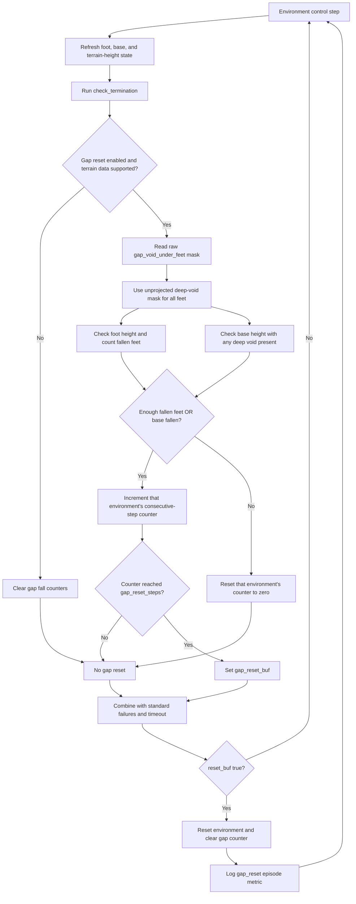

# KITE Unrecoverable-Gap Reset Configuration Reference

The gap-reset logic documented here is implemented by:

- `legged_gym/envs/go2/go2_kite/go2_kite.py`
- `legged_gym/envs/go2/go2_kite_baseline/go2_kite_baseline.py`

Its configuration is defined in:

- `legged_gym/envs/go2/go2_kite/go2_kite_config.py`
- `legged_gym/envs/go2/go2_kite_baseline/go2_kite_baseline_config.py`

The reset detects robots that have fallen into the deep voids used by gap,
stepping-stone, and high-platform-with-gap terrains. It combines terrain
classification with the world-space height of the feet or base so that merely
passing a foot over a gap does not terminate an episode.

## Enablement and Requirements

| Config item | KITe value | Baseline value | Purpose |
|---|---:|---:|---|
| `termination.reset_unrecoverable_gaps` | `True` | `True` | Enables the unrecoverable-gap reset. |
| `terrain.mesh_type` | `"heightfield"` | `"heightfield"` | Must be `"heightfield"` or `"trimesh"` for the reset to operate. |
| `terrain.obtain_terrain_info_around_feet` | `True` | `True` | Enables the terrain-height samples used to identify deep voids beneath the feet. |

If any requirement is not satisfied, `_check_unrecoverable_gap()` clears the
per-environment fall counters and returns no gap resets.

The Genesis simulator measures nine terrain heights around every foot and also
stores a raw deep-void mask before any gap-aware projection is applied to the
height and normal buffers. The gap-reset logic uses that raw mask:

```text
deep_void = simulator.gap_void_under_feet
```

This separation matters because `_height_around_feet` may contain projected
next-edge terrain values when a swing foot passes over a gap. Reset detection
must still see the unprojected void under the foot. The raw mask is computed
from the original center sample, equivalent to sample index `4` of the
unprojected 3 x 3 patch.

All raw height comparisons use `simulator.env_origins[:, 2]` as the local
support height for each environment.

## Detection Parameters

| Config item | KITe value | Baseline value | Purpose |
|---|---:|---:|---|
| `termination.gap_terrain_depth_threshold` | `1.0` m | `1.0` m | Classifies terrain more than this distance below the environment origin as a deep void. |
| `termination.gap_foot_drop_threshold` | `0.25` m | `0.18` m | Requires a foot over a deep void to fall this far below the environment origin before it counts as fallen. |
| `termination.gap_base_drop_threshold` | `0.30` m | `0.25` m | Requires the base to fall this far below the environment origin before the base-fall path activates. |
| `termination.gap_min_fallen_feet` | `1` | `1` | Minimum number of simultaneously fallen feet required by the foot-fall path. |
| `termination.gap_reset_steps` | `4` | `2` | Number of consecutive control timesteps for which a gap-fall condition must remain true. |

The visual KITe configuration is less sensitive than the baseline: it requires
larger foot and base drops and twice as many consecutive detections. This
reduces premature resets during transient visual-policy foot-placement errors.
The baseline configuration terminates confirmed falls sooner.

## Void Classification

For each foot, terrain is classified as a deep void when:

```text
deep_void =
    raw_terrain_under_foot
    < environment_origin_z - gap_terrain_depth_threshold
```

The `1.0` m threshold separates intentionally unrecoverable free space from
ordinary terrain variation. Current stepping-stone and high-platform gap
generators use void depths near `-10` m, while the gap terrain writes a very
large negative height-field value. In contrast, normal obstacles, slopes,
platforms, and curriculum pits are much shallower.

This classification prevents a low foot by itself from causing a gap reset on
ordinary terrain.

## Foot-Fall Path

A foot counts as fallen only when both conditions are true:

```text
fallen_foot =
    deep_void
    AND foot_z < environment_origin_z - gap_foot_drop_threshold
```

The environment-level foot condition is:

```text
enough_fallen_feet =
    count(fallen_foot) >= gap_min_fallen_feet
```

The drop threshold allows normal swing trajectories and brief motion over a
gap. A foot must descend substantially below the local support plane before it
is treated as having entered free space.

`gap_min_fallen_feet = 1` is intentionally responsive because one leg dropping
deep into an artificial void is already a strong indication that the robot has
missed its support surface. Raising it would allow single-leg gap entries to
continue until another leg or the base also fell.

## Base-Fall Path

The base condition is:

```text
base_fallen =
    any(deep_void_under_feet)
    AND base_z < environment_origin_z - gap_base_drop_threshold
```

Requiring a deep void under at least one foot prevents a low base on ordinary
terrain from being mislabeled as a gap fall. The base-height condition catches
cases where the torso has entered the void even if foot geometry alone does
not satisfy the foot-count test.

The base thresholds are larger than the normal standing-height margin. A reset
therefore occurs only after the torso is well below the environment support
plane and recovery is no longer realistic.

## Consecutive-Step Filter

The two detection paths are combined:

```text
falling_into_gap = enough_fallen_feet OR base_fallen
```

Each environment maintains an independent counter:

```text
if falling_into_gap:
    gap_fall_counter += 1
else:
    gap_fall_counter = 0

gap_reset = gap_fall_counter >= gap_reset_steps
```

The counter requires consecutive detections. A single non-matching control
step clears it, which filters height-field boundary noise and brief threshold
crossings.

With the current `control.dt = 0.02` seconds:

- KITe's `gap_reset_steps = 4` requires approximately `0.08` seconds.
- The baseline's `gap_reset_steps = 2` requires approximately `0.04` seconds.

These are control timesteps, not physics substeps, PPO iterations, or summed
steps across parallel environments.

## Reset Integration

`check_termination()` evaluates the gap condition every control timestep. The
result is included directly in the environment reset expression:

```text
reset =
    delayed_standard_failure
    OR episode_timeout
    OR gap_reset
```

Unlike standard contact, orientation, and height failures, `gap_reset_buf` is
not delayed by `env.fail_to_terminal_time_s`. The consecutive-step filter is
the gap detector's debounce mechanism, and a confirmed gap fall resets
immediately.

When the environment resets, `gap_fall_counter` is cleared for the affected
environment.

## Training Flow



## Logged Metric

The following value is added to `extras["episode"]`:

| Metric | Meaning |
|---|---|
| `gap_reset` | Fraction of the environments in the current reset batch whose `gap_reset_buf` is true. |

This metric can be plotted during training to identify whether terrain
difficulty or command-range changes are producing more unrecoverable falls.
Because a reset batch can include timeouts and other failures, the value is a
batch fraction rather than a global episode count.

## Parameter-Tuning Effects

| Change | Effect |
|---|---|
| Increase `gap_terrain_depth_threshold` | Only deeper terrain is classified as a void; reduces false positives but may miss shallower unrecoverable gaps. |
| Decrease `gap_terrain_depth_threshold` | More depressions qualify as voids; catches shallow gaps sooner but may classify recoverable pits as unrecoverable. |
| Increase a drop threshold | Requires the foot or base to fall farther before detection; delays resets and reduces false positives. |
| Decrease a drop threshold | Detects falls earlier but increases sensitivity to swing motion and terrain-height noise. |
| Increase `gap_min_fallen_feet` | Requires more legs to enter the void; less sensitive to single-foot misses. |
| Increase `gap_reset_steps` | Requires longer persistence; improves debounce but spends more simulation time in unrecoverable states. |

When changing generated gap depth, terrain vertical scale, or environment
origin placement, revalidate `gap_terrain_depth_threshold` first. The foot and
base thresholds should then be tuned against observed world-space trajectories
near gap edges.

## Main Downstream Files

- `legged_gym/envs/go2/go2_kite/go2_kite.py`
  - Evaluates the gap condition, integrates it into termination, resets the
    counter, and logs the result.
- `legged_gym/envs/go2/go2_kite_baseline/go2_kite_baseline.py`
  - Provides the same behavior with baseline-specific threshold defaults.
- `legged_gym/simulator/genesis_simulator.py`
  - Samples the terrain height directly under and around each foot.
- `legged_gym/utils/terrain_utils.py`
  - Generates deep voids for stepping-stone, gap, and high-platform gap
    terrains.
