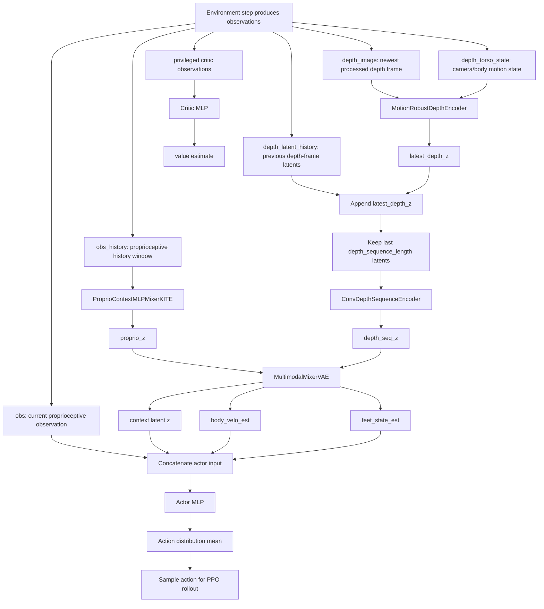
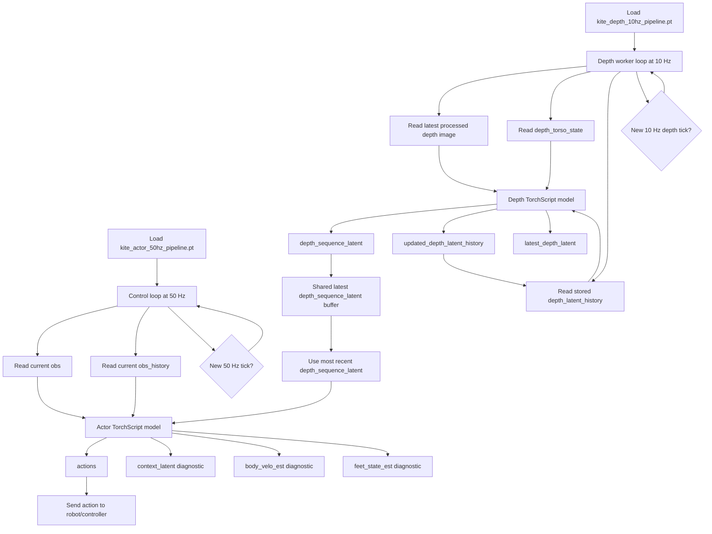

# KITE Actor-Critic and Async Export Reference

This document describes the KITE actor-critic implementation and the utilities
used to export it as two separate TorchScript deployment models.

The relevant code lives in:

- `rsl_rl/modules/actor_critic_kite.py`
- `rsl_rl/runners/kite_runner.py`
- `legged_gym/scripts/export_kite_async_jit.py`

## Actor-Critic Components

| Component | Class or attribute | Purpose |
|---|---|---|
| Proprioceptive history encoder | `ProprioContextMLPMixerKITE` | Compresses `obs_history` into a proprioceptive latent. |
| Depth-frame encoder | `MotionRobustDepthEncoder` | Encodes the most recent processed depth image, conditioned on `depth_torso_state`. |
| Depth-sequence encoder | `ConvDepthSequenceEncoder` | Compresses a short history of depth-frame latents into one depth-sequence latent. |
| Modality mixer | `MultimodalMixerVAE` | Fuses proprioceptive and visual latents into the policy context latent and auxiliary state estimates. |
| Actor | `self.actor` | Maps current proprioception, context latent, and estimated state into actions. |
| Critic | `self.critic` | Maps privileged critic observations to a scalar value estimate during PPO training. |

The actor input is:

```text
current_proprio_obs + context_latent + estimated_context_state
```

where:

```text
estimated_context_state = body_velo_est + feet_state_est
```

## Training-Time Data Management

During training, the monolithic `ActorCritic_KITE` class still owns the full
encoder stack. The training-time `act()` path computes the visual, proprioceptive,
and modality-mixer outputs in one synchronous forward pass.



Important training-time notes:

- `act()` uses the stochastic PPO distribution and returns sampled actions.
- `act_inference()` remains available for simulated inference, but it still runs
  the full encoder stack synchronously.
- The deployment split does not change the training forward path by itself.
- The encoder optimizers are split by submodule: proprioceptive, visual-frame,
  visual-sequence, and modality-mixer.

## Async Deployment Split

Deployment needs two independent models because depth processing is slower than
the control loop:

| Deployment model | Intended rate | File name | Responsibility |
|---|---:|---|---|
| Depth pipeline | 10 Hz | `kite_depth_10hz_pipeline.pt` | Encode the latest depth image and update the depth latent history. |
| Actor pipeline | 50 Hz | `kite_actor_50hz_pipeline.pt` | Run proprioception, modality mixing, and actor action generation using the latest depth-sequence latent. |

The split wrappers are:

| Wrapper | Inputs | Outputs |
|---|---|---|
| `KITEDepthAsyncPipeline` | `depth_image`, `depth_torso_state`, `depth_latent_history` | `depth_sequence_latent`, `updated_depth_latent_history`, `latest_depth_latent` |
| `KITEActorAsyncPipeline` | `obs`, `obs_history`, `depth_sequence_latent` | `actions`, `context_latent`, `body_velo_est`, `feet_state_est` |

The wrappers deep-copy their owned submodules from the trained
`ActorCritic_KITE` instance. That makes the exported TorchScript files
independent artifacts rather than two entry points into one shared Python
object.

## Deployment-Time JIT Flow



At deployment time, the 50 Hz actor loop should treat
`depth_sequence_latent` as a latched asynchronous input. If the depth worker has
not produced a new latent on a given control tick, the actor reuses the most
recent value.

## Export Utilities

The module-level helpers are:

| Function | Purpose |
|---|---|
| `build_kite_async_deployment_pipelines(actor_critic, device)` | Builds the two unscripted deployment modules. |
| `script_kite_async_deployment_pipelines(actor_critic, device)` | TorchScripts the depth and actor deployment modules. |
| `export_kite_async_deployment_pipelines(actor_critic, path, device)` | Scripts and saves both deployment modules to disk. |

The KITE runner also exposes:

| Runner method | Purpose |
|---|---|
| `get_async_inference_pipelines(device)` | Returns the two unscripted async deployment modules. |
| `export_async_inference_pipelines(path, device)` | Saves the two scripted async deployment modules. |

## Export Script

Use:

```bash
python legged_gym/scripts/export_kite_async_jit.py \
    --task go2_kite \
    --load_run <run_name> \
    --ckpt <checkpoint>
```

The script:

1. Loads the KITE task config.
2. Creates a one-environment KITE runner.
3. Loads only model weights from the selected checkpoint.
4. Builds the independent depth and actor deployment wrappers.
5. Saves both wrappers as separate TorchScript files under:

```text
<run_dir>/exported_async/
```

## Expected Runtime State

The deployment runtime should keep two pieces of state outside the models:

| Runtime state | Shape | Owner |
|---|---|---|
| `depth_latent_history` | `B x (depth_sequence_length - 1) x depth_latent_dim` | 10 Hz depth worker |
| `latest_depth_sequence_latent` | `B x depth_latent_dim` | Shared from 10 Hz worker to 50 Hz actor loop |

On startup, both can be initialized to zeros. After the first depth update,
`latest_depth_sequence_latent` should be replaced by the depth model output and
then reused by the actor model until the next 10 Hz update arrives.
