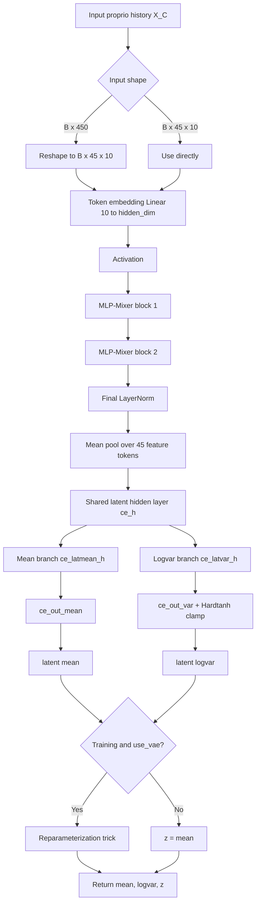

# KITE Proprioceptive MLP-Mixer Encoder Reference

This file documents the active MLP-Mixer encoder implemented in:

- `rsl_rl/modules/kite_proprio_encoder.py`

The primary class is `ProprioContextMLPMixerKITE`. It is a VAE-style encoder
for proprioceptive history. The older `ProprioContextEncoderKITE` MLP is still
present in the file, but it is commented out.

## Purpose

The encoder converts a flattened proprioceptive observation history into a
compact latent vector. The intended default input is:

```text
X_C: B x 450
```

This is reshaped as:

```text
B x 45 x 10
```

where:

| Dimension | Meaning |
|---|---|
| `B` | Batch size. |
| `45` | Proprioceptive feature tokens. Each token corresponds to one feature channel tracked through history. |
| `10` | History length per feature token. |

The MLP-Mixer architecture is useful here because it separates two kinds of
reasoning:

- **Token mixing:** lets each proprioceptive feature exchange information with
  other features.
- **Channel mixing:** lets each feature refine its embedded temporal
  representation.

## Main Modules

| Module | Role |
|---|---|
| `MixerMLP` | Two-layer MLP used by both token-mixing and channel-mixing paths. |
| `MLPMixerBlock` | Residual block containing one token mixer and one channel mixer. |
| `ProprioContextMLPMixerKITE` | Full proprioceptive context encoder with VAE-style latent heads. |

## Default Architecture

The default constructor values are:

| Argument | Default | Meaning |
|---|---:|---|
| `context_input_dim` | `450` | Flattened input dimension. Must equal `num_tokens * input_dim_per_token`. |
| `num_tokens` | `45` | Number of proprioceptive feature tokens. |
| `input_dim_per_token` | `10` | History samples per token. |
| `hidden_dim` | `128` | Embedded channel width for every token. |
| `num_mixer_blocks` | `2` | Number of stacked MLP-Mixer blocks. |
| `token_mlp_dim` | `128` | Hidden size inside the token-mixing MLP. |
| `channel_mlp_dim` | `256` | Hidden size inside the channel-mixing MLP. |
| `context_latent_size` | `16` | Size of the final latent vector. |
| `activation` | `elu` | Activation selected through `module_utils.get_activation()`. |
| `use_layer_norm` | `True` | Enables pre-normalization inside mixer blocks and final normalization. |
| `logvar_min` / `logvar_max` | `-5.0` / `5.0` | Clamp range for the latent log variance. |
| `use_vae` | `True` | Samples `z` during training; uses `mean` during evaluation. |

## Data Flow



## Mixer Block Details

Each `MLPMixerBlock` receives:

```text
x: B x num_tokens x hidden_dim
```

The block has two residual sublayers.

### Token Mixing

Token mixing exchanges information across the `num_tokens` dimension:

```text
y = LayerNorm(x)
y = transpose(y)                  # B x hidden_dim x num_tokens
y = token_mixer(y)                # MLP over token dimension
y = transpose(y)                  # B x num_tokens x hidden_dim
x = x + y
```

This lets a feature token, for example a joint-velocity history channel, use
information from other feature tokens such as commands, projected gravity, or
actions.

### Channel Mixing

Channel mixing refines the hidden representation inside each token:

```text
y = LayerNorm(x)
y = channel_mixer(y)              # MLP over hidden_dim
x = x + y
```

This is analogous to the feed-forward sublayer in a Transformer block, but
without attention.

## Latent Heads

After all mixer blocks, the encoder applies a final normalization and averages
over tokens:

```text
B x 45 x hidden_dim -> B x hidden_dim
```

Then it builds a latent distribution:

```text
x = activation(ce_h(pooled))
lat_mean = activation(ce_latmean_h(x))
lat_var = activation(ce_latvar_h(x))
mean = ce_out_mean(lat_mean)
logvar = ce_out_var(lat_var)
```

`ce_out_var` includes a `Hardtanh` clamp, so the log variance remains between
`logvar_min` and `logvar_max`.

During training, when `use_vae=True`, the encoder samples:

```text
z = mean + exp(0.5 * logvar) * epsilon
```

where `epsilon` is standard Gaussian noise with the same shape as `logvar`.
During evaluation or when `use_vae=False`, the encoder returns:

```text
z = mean
```

## Outputs

The active `forward()` method returns:

```text
mean, logvar, z
```

with shapes:

```text
mean:   B x context_latent_size
logvar: B x context_latent_size
z:      B x context_latent_size
```

`forward_inference()` is deterministic and returns only:

```text
mean
```

## Integration Notes

The current KITE actor-critic path in `rsl_rl/modules/actor_critic_kite.py`
expects its context encoder API to return:

```text
mean, logvar, z, torso_velo
```

and inference expects:

```text
z, torso_velo
```

`ProprioContextMLPMixerKITE` does not currently include the torso-velocity or
explicit-label prediction head. If this mixer encoder is used as a drop-in
replacement for the current context encoder, either the actor-critic interface
must be updated, or the mixer encoder must gain an additional prediction head.

The PPO encoder loss in `rsl_rl/algorithms/ppo_kite.py` also expects the
context encoder to provide a latent vector and a `cenet_torso_velo` prediction
for the explicit-label MSE term.

## Initialization

Linear layers in the mixer MLPs, token embedding, and hidden latent heads use
Kaiming uniform initialization with a leaky-ReLU gain approximation. The final
mean and logvar output layers use Kaiming uniform initialization with a linear
nonlinearity. LayerNorm weights are initialized to `1` and biases to `0`.
