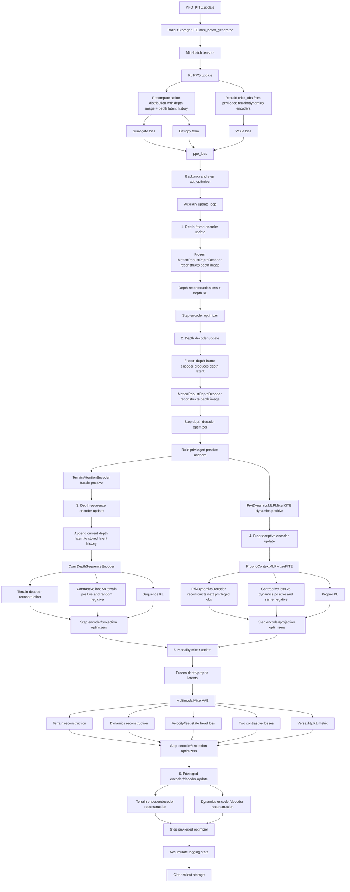

# KITE Runner and PPO Execution Reference

This document explains the training-time execution flow for the KITE runner and
PPO implementation after the depth-image and privileged-latent training updates.

The main files are:

- `rsl_rl/runners/kite_runner.py`
- `rsl_rl/algorithms/ppo_kite.py`
- `rsl_rl/storage/rollout_storage_kite.py`
- `rsl_rl/modules/actor_critic_kite.py`
- `rsl_rl/modules/kite_privileged_encoders.py`

## Main Objects

| Object | File | Role |
|---|---|---|
| `OnPolicyRunnerKITE` | `rsl_rl/runners/kite_runner.py` | Owns the environment loop, rollout collection, depth latent history, logging, checkpointing, and calls into PPO. |
| `PPO_KITE` | `rsl_rl/algorithms/ppo_kite.py` | Owns PPO loss computation, actor-critic updates, auxiliary encoder/decoder updates, and critic input construction. |
| `RolloutStorageKITE` | `rsl_rl/storage/rollout_storage_kite.py` | Stores per-timestep rollout tensors and yields flattened mini-batches for learning. |
| `ActorCritic_KITE` | `rsl_rl/modules/actor_critic_kite.py` | Owns policy-facing encoders, actor, critic, and action distribution. |
| Privileged encoders/decoders | `rsl_rl/modules/kite_privileged_encoders.py` | Encode privileged terrain and dynamics into critic/teacher latents and decode auxiliary reconstruction targets. |

## Runner Initialization

`OnPolicyRunnerKITE.__init__()` builds the training stack:

1. Reads KITE policy and algorithm config.
2. Computes critic input size as:

```text
latest privileged obs
+ privileged terrain latent
+ privileged dynamics latent
```

3. Creates `ActorCritic_KITE`.
4. Creates `PPO_KITE`, which also creates the depth decoder and privileged
   terrain/dynamics encoders/decoders.
5. Allocates `depth_latent_history` with shape:

```text
num_envs x (depth_sequence_length - 1) x depth_latent_dim
```

6. Initializes `RolloutStorageKITE` with depth image, depth latent history,
   terrain map, privileged history, and PPO tensors.

## Collection Phase

During rollout collection, the runner stores only the current processed depth
image as an image. Previous visual context is held as latent vectors to reduce
VRAM use.

```mermaid
flowchart TD
    A[Start learning iteration] --> B[Read env observations]
    B --> C[obs]
    B --> D[obs_history]
    B --> E[privileged_obs_history]
    B --> F[processed depth image history]
    B --> G[depth_torso_state]
    B --> H[terrain_map]

    F --> I[Select newest depth image: depth_obs[:, 0:1]]
    E --> J[PPO_KITE.build_critic_obs]
    H --> J
    J --> K[critic_obs = latest privileged obs + terrain latent + dynamics latent]

    K --> L[Rollout step loop]
    C --> M[PPO_KITE.act]
    D --> M
    I --> M
    N[depth_latent_history] --> M
    G --> M
    K --> M
    H --> M

    M --> O[ActorCritic_KITE.act or act_bootmask]
    O --> P[Sampled actions]
    M --> Q[latest_depth_latent]
    M --> R[Transition stores pre-step tensors]

    P --> S[env.step(actions)]
    S --> T[next obs and training targets]
    T --> U[next privileged_obs_history]
    T --> V[next depth image]
    T --> W[next depth_torso_state]
    T --> X[next terrain_map]
    T --> Y[rewards, dones, infos, GRFs]

    U --> Z[Rebuild next critic_obs through privileged encoders]
    X --> Z
    Q --> AA[Roll depth_latent_history forward]
    AA --> AB{done?}
    AB -- Yes --> AC[Zero depth history for reset envs]
    AB -- No --> AD[Keep updated history]

    Y --> AE[PPO_KITE.process_env_step]
    U --> AE
    AE --> AF[RolloutStorageKITE.add_transitions]
    AF --> L

    L --> AG[After num_steps_per_env]
    AG --> AH[PPO_KITE.compute_returns using last critic_obs]
    AH --> AI[PPO_KITE.update]
```

### Stored Per-Step Tensors

`RolloutStorageKITE` stores:

| Tensor | Purpose |
|---|---|
| `observations` | Current actor proprioceptive observation. |
| `observation_history` | Proprioceptive history for `ProprioContextMLPMixerKITE`. |
| `critic_observations` | Critic input used when action/value was collected. |
| `privileged_observation_history` | Raw privileged dynamics history for rebuilding critic inputs and training privileged dynamics encoder. |
| `depth_images` | Newest processed depth image only. |
| `depth_latent_history` | Previous depth-frame latents, length `depth_sequence_length - 1`. |
| `depth_torso_state` | 8D depth-conditioning vector: `[roll, pitch, body_velo_xyz, imu_gyro_xyz]`; velocity is predicted when the velocity-specific boot gate is on and simulator fallback otherwise. |
| `terrain_maps` | Privileged `B x H x W x 4` terrain target: height + XYZ surface normal. |
| `contrastive_negative_anchors` | Shared random negative latent used by contrastive auxiliary losses. |
| `explicit_labels` | Velocity/feet-state supervision for modality heads. |
| `observation_targets` | Next privileged observation target for dynamics reconstruction. |

## Learning Phase

`PPO_KITE.update()` consumes mini-batches from `RolloutStorageKITE`. Each
mini-batch first receives the PPO update, then the auxiliary representation
updates.



## PPO Loss Inputs

The PPO update recomputes the actor and critic on the mini-batch:

| Input | Used by |
|---|---|
| `obs_batch` | Actor current proprioceptive input. |
| `obs_hist_batch` | Proprioceptive encoder. |
| `depth_images_batch` | Depth-frame encoder. |
| `depth_latent_history_batch` | Depth-sequence encoder context. |
| `depth_torso_state_batch` | Depth encoder/decoder conditioning using roll/pitch, velocity-specific boot-gated torso linear velocity, and IMU angular velocity. |
| `privileged_obs_history_batch` | Privileged dynamics encoder and latest privileged critic features. |
| `terrain_maps_batch` | Privileged terrain encoder and terrain reconstruction target. |

The RL update rebuilds critic observations using `build_critic_obs()`. By
default, privileged latents are detached for the PPO value loss. This keeps PPO
from updating the privileged encoders directly; those modules are trained during
the auxiliary phase.

## Auxiliary Loss Families

| Stage | Trainable modules | Frozen/anchor modules | Main losses |
|---|---|---|---|
| Depth-frame encoder | `MotionRobustDepthEncoder` | `MotionRobustDepthDecoder` | Depth image reconstruction, KL. |
| Depth decoder | `MotionRobustDepthDecoder` | `MotionRobustDepthEncoder` | Depth image reconstruction. |
| Depth sequence | `ConvDepthSequenceEncoder`, depth-to-terrain projection | Privileged terrain encoder/decoder anchors | Terrain reconstruction, contrastive, KL. |
| Proprioceptive encoder | `ProprioContextMLPMixerKITE`, proprio-to-dynamics projection | Privileged dynamics encoder/decoder anchors | Dynamics reconstruction, contrastive, KL. |
| Modality mixer | `MultimodalMixerVAE`, mixer projection heads | Privileged terrain/dynamics anchors and decoders | Terrain reconstruction, dynamics reconstruction, explicit state heads, contrastive, versatility/KL. |
| Privileged modules | Terrain/dynamics encoders and decoders | None | Terrain reconstruction, dynamics reconstruction. |

## Checkpoint Contents

`OnPolicyRunnerKITE.save()` stores:

- actor-critic weights,
- actor/critic optimizer,
- encoder optimizer bundle,
- legacy context decoder and optimizer,
- depth decoder and optimizer,
- privileged terrain/dynamics encoder/decoder weights,
- privileged optimizer,
- auxiliary projection heads and optimizer,
- current learning iteration.

The loader accepts older checkpoints where the new auxiliary keys are absent.
Model weights that exist are loaded; missing new auxiliary modules are left at
their initialized values.

## Notes

- The runner owns `depth_latent_history` during rollout collection.
- Storage owns a per-timestep snapshot of the depth latent history that was used
  to produce that timestep's action.
- The current raw depth image is stored, but older depth frames are represented
  only by latents.
- Terrain information reaches the critic through privileged terrain latents,
  not by appending raw height maps to `privileged_obs`.
