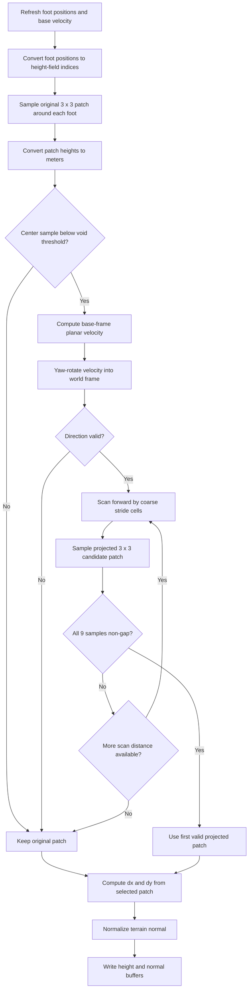

# KITE Terrain-Around-Feet Sampling Reference

The terrain-around-feet logic documented here is implemented by:

- `legged_gym/simulator/genesis_simulator_kite.py`

Its projection behavior is configured in:

- `legged_gym/envs/go2/go2_kite/go2_kite_config.py`
- `legged_gym/envs/go2/go2_kite_baseline/go2_kite_baseline_config.py`

`GenesisSimulator_KITE._calc_terrain_info_around_feet()` populates two
projected terrain buffers and one raw gap-detection buffer:

- `_height_around_feet`: a 3 x 3 terrain-height patch around each foot.
- `_normal_vector_around_feet`: one terrain normal per foot, computed from the
  same 3 x 3 patch.
- `_gap_void_under_feet`: raw deep-void flags under each foot before
  projection is applied.

These buffers are used by privileged observations, terrain-aware clearance
rewards, and terrain-normal swing-leg rewards. The gap-aware projection path
keeps those consumers from seeing the bottom of a deep void when a swing foot
passes over a gap. Instead, the foot receives terrain information from the next
valid edge in the direction of robot motion.

## Output Buffers

| Buffer | Shape | Meaning |
|---|---:|---|
| `_height_around_feet` | `num_envs x 4 x 9` | Nine world-height samples around each foot, in meters. |
| `_normal_vector_around_feet` | `num_envs x 12` | Four normalized XYZ terrain normals, flattened as `4 x 3`. |
| `_gap_void_under_feet` | `num_envs x 4` | Raw per-foot gap flags from the unprojected center sample. |

The 9 height samples use this fixed order:

| Index | Height-field offset | Meaning |
|---:|---:|---|
| `0` | `[-1, 0]` | Behind/negative x neighbor. |
| `1` | `[+1, 0]` | Forward/positive x neighbor. |
| `2` | `[0, -1]` | Negative y neighbor. |
| `3` | `[0, +1]` | Positive y neighbor. |
| `4` | `[0, 0]` | Sample directly under the foot. |
| `5` | `[-1, -1]` | Negative x, negative y diagonal. |
| `6` | `[+1, +1]` | Positive x, positive y diagonal. |
| `7` | `[-1, +1]` | Negative x, positive y diagonal. |
| `8` | `[+1, -1]` | Positive x, negative y diagonal. |

The same sample order is used before and after gap projection.

## Configuration

| Config item | KITE value | Baseline value | Purpose |
|---|---:|---:|---|
| `termination.gap_terrain_depth_threshold` | `1.0` m | `1.0` m | Classifies terrain below the environment origin by this amount as a deep void. |
| `termination.gap_terrain_projection_max_distance` | `1.5` m | `1.5` m | Maximum distance to scan from the foot toward the next valid terrain patch. |
| `termination.gap_terrain_projection_stride_cells` | `3` cells | `3` cells | Coarse scan stride in height-field cells. |

`gap_terrain_depth_threshold` is shared with the unrecoverable-gap reset logic.
This keeps gap classification consistent across reset detection and terrain
buffer population.

`gap_terrain_projection_stride_cells` is intentionally specified in height-field
cells rather than meters. With a `0.1` m horizontal scale and the default value
of `3`, projected patches are tested every `0.3` m.

## Normal Terrain Path

On every simulator post-physics step, terrain information around each foot is
updated after base, foot, and terrain state have been refreshed.

For normal terrain, `_calc_terrain_info_around_feet()`:

1. Converts each world-frame foot position into height-field grid indices.
2. Clamps the indices so the full 3 x 3 patch can be sampled safely.
3. Samples the 9 height-field cells in the fixed order above.
4. Converts raw height-field units into meters with `terrain.vertical_scale`.
5. Computes local height gradients:

```text
dx = (height[x+1, y] - height[x-1, y]) / (2 * horizontal_scale)
dy = (height[x, y+1] - height[x, y-1]) / (2 * horizontal_scale)
```

6. Builds and normalizes the terrain normal:

```text
normal = normalize([-dx, -dy, 1])
```

7. Writes the height patch and normal into the simulator buffers.

## Gap Detection

A foot is considered to be over a gap when the center sample of its patch is a
deep void:

```text
foot_over_gap =
    height_patch[:, foot, 4]
    < env_origin_z - gap_terrain_depth_threshold
```

This raw result is written to `_gap_void_under_feet` before any projected patch
can replace `_height_around_feet`. Reset detection uses the raw mask, while
terrain rewards and observations use the projected height and normal buffers.

Only the center sample is used to trigger projection. The replacement candidate
patch must be fully valid, which means all 9 samples must be at or above the
same void threshold.

This distinction is intentional:

- A foot begins projection as soon as it is over a gap.
- The projected replacement is accepted only when the entire 3 x 3 field is on
  valid terrain.

## Motion Direction

Projection direction comes from the robot's measured base linear velocity:

```text
direction_base = base_lin_vel[:, :2]
direction_world = yaw_rotate(base_quat, direction_base)
```

The direction is yaw-rotated from base frame into world frame, then normalized.
If the planar base velocity is near zero, projection is skipped for that
environment and the original patch is retained. This avoids fabricating a
direction when the robot is not moving.

## Projected Edge Search

For feet whose center sample is over a gap, the function scans forward along
the world-frame motion direction.

At each scan distance:

1. Convert the projected offset into integer height-field cells.
2. Sample a candidate 3 x 3 patch at the projected center.
3. Convert candidate heights into meters.
4. Accept the candidate only if all 9 heights are non-gap:

```text
candidate_valid =
    all(candidate_patch >= env_origin_z - gap_terrain_depth_threshold)
```

5. For each foot, keep the first valid candidate found.

The scan is vectorized across all environments and feet. The only loop is over
the small set of projection distances:

```text
stride_cells, 2 * stride_cells, ..., max_projection_cells
```

This keeps the work bounded by:

```text
ceil(max_distance / horizontal_scale / stride_cells)
```

With the default `1.5` m max distance, `0.1` m horizontal scale, and `3`-cell
stride, the function checks at most five projected distances.

## Fallback Behavior

The original foot-centered patch is retained when:

- The foot is not over a deep void.
- The robot's planar motion direction is too small to normalize.
- No fully valid projected 3 x 3 patch is found within the configured maximum
  distance.

The fallback is conservative. It avoids replacing terrain information with a
partial edge sample or a directionless projection.

## Downstream Effects

Because the simulator buffers are updated directly, all downstream consumers
see the same gap-aware terrain estimate:

| Consumer | File | Effect |
|---|---|---|
| Privileged critic observations | `go2_kite.py`, `go2_kite_baseline.py` | Terrain normals and foot heights no longer report deep void values for swing feet that are merely passing over a gap. |
| `_reward_swing_vel_ellipsoid_terrain()` | `go2_kite.py` | Swing-leg posture is rewarded against the next valid terrain edge normal. |
| `_reward_foot_clearance_terrain_aware()` | `go2_kite.py` | Local terrain clearance uses the projected 3 x 3 patch when a foot is over a gap. |
| Gap reset detection | `go2_kite.py`, `go2_kite_baseline.py` | Reads `gap_void_under_feet`, the raw unprojected void mask, so projection does not hide a falling foot. |

## Execution Flow



## Tuning Effects

| Change | Effect |
|---|---|
| Increase `gap_terrain_projection_max_distance` | Finds farther landing edges across larger gaps, at the cost of more candidate scans. |
| Decrease `gap_terrain_projection_max_distance` | Reduces scan work, but may leave wide-gap swing feet with void samples. |
| Increase `gap_terrain_projection_stride_cells` | Reduces scan work and makes the search coarser; can skip narrow valid edges. |
| Decrease `gap_terrain_projection_stride_cells` | Searches more finely; improves edge detection at the cost of more height-field samples. |
| Increase `gap_terrain_depth_threshold` | Only deeper terrain is treated as void, reducing replacement frequency. |
| Decrease `gap_terrain_depth_threshold` | More terrain depressions trigger projection, which may be useful for aggressive gap curricula but can affect ordinary pits. |
