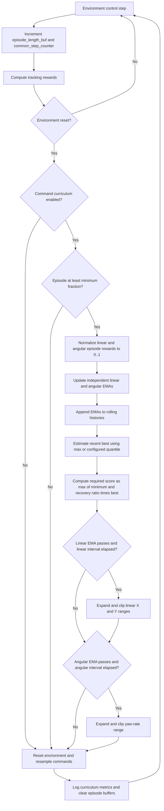

# KITE Velocity-Command Curriculum Configuration Reference

The settings documented here are shared by:

- `legged_gym/envs/go2/go2_kite/go2_kite_config.py`
- `legged_gym/envs/go2/go2_kite_baseline/go2_kite_baseline_config.py`

The implementation is duplicated in the corresponding `go2_kite.py` and
`go2_kite_baseline.py` environments. Linear and angular tracking maintain
independent performance estimates, recovery thresholds, timers, and command
range updates.

## Enablement and Initial Ranges

| Config item | Current value | Purpose |
|---|---:|---|
| `commands.curriculum` | `True` | Enables command-curriculum updates during environment resets. |
| `commands.ranges.lin_vel_x` | `[-0.5, 0.5]` m/s | Initial forward/backward command range. |
| `commands.ranges.lin_vel_y` | `[-0.3, 0.3]` m/s | Initial lateral command range. |
| `commands.ranges.ang_vel_yaw` | `[-1.0, 1.0]` rad/s | Initial yaw-rate command range. |
| `commands.heading_command` | `True` | Samples a heading target and computes the yaw-rate command from heading error. The angular curriculum still expands `ang_vel_yaw`, which bounds that computed yaw-rate command. |

The curriculum is called from `reset_idx()` before the completed environments'
episode lengths and reward sums are cleared.

## Performance Estimation

| Config item | Current value | Purpose |
|---|---:|---|
| `commands.curriculum_ema_alpha` | `0.05` | EMA weight assigned to the newest batch of completed episodes. Smaller values produce a smoother, slower-moving estimate. |
| `commands.curriculum_best_window` | `400` | Maximum number of EMA values retained when estimating recent best performance. |
| `commands.curriculum_best_quantile` | `0.90` | Uses the 90th percentile of the retained EMA history as the demonstrated best after at least 10 samples. Before then, it uses the maximum. |
| `commands.curriculum_min_episode_fraction` | `0.25` | Excludes episodes shorter than 25% of `max_episode_length` from command-curriculum performance updates. |

Linear performance is taken from `tracking_lin_vel`; angular performance is
taken from `tracking_ang_vel`. For each eligible completed episode, the code
normalizes the accumulated reward as:

```text
normalized_tracking =
    episode_reward_sum / (episode_steps * active_reward_scale)
```

The result is clamped to `[0, 1]`. Both tracking reward functions have a
theoretical maximum of `1.0` per step, so this value represents a fraction of
the attainable tracking reward. Dividing out the active reward scale and
episode length also makes the metric independent of reward coefficient and
episode duration.

The normalized values are averaged over the eligible environments in the
current reset batch. The corresponding EMA is then updated:

```text
tracking_ema =
    (1 - curriculum_ema_alpha) * previous_ema
    + curriculum_ema_alpha * current_batch_mean
```

The first valid batch initializes the EMA directly.

## Recovery Gate

| Config item | Current value | Purpose |
|---|---:|---|
| `commands.curriculum_recovery_ratio` | `0.90` | Requires the EMA to recover to 90% of its recent demonstrated best before expanding that command range. |
| `commands.curriculum_min_lin_tracking` | `0.70` | Absolute minimum linear tracking score required, as a fraction of attainable linear tracking reward. |
| `commands.curriculum_min_ang_tracking` | `0.70` | Absolute minimum angular tracking score required, as a fraction of attainable angular tracking reward. |

The linear and angular required scores are computed independently:

```text
required_tracking =
    max(minimum_tracking, curriculum_recovery_ratio * recent_best_tracking)
```

For example, if the recent best linear EMA is `0.90`, the recovery component is
`0.90 * 0.90 = 0.81`, so the required linear score is `0.81`. If the recent
best is only `0.60`, the configured minimum keeps the required score at `0.70`.

EMA history is retained when a command range expands. The performance drop
caused by the harder range must therefore recover toward the previously
demonstrated level before another expansion is permitted. As the rolling
window advances, the best estimate can adapt to sustained performance under
the newer command ranges.

## Update Timing

| Config item | Current value | Purpose |
|---|---:|---|
| `commands.curriculum_update_interval_steps` | `12000` | Minimum number of control timesteps between range expansions for each independent gate. |

`curriculum_update_interval_steps` counts calls to `post_physics_step()` through
`common_step_counter`. It is not a PPO iteration count and is not multiplied by
the number of parallel environments.

With the current `control.dt = 0.02` seconds, `12000` control timesteps represent
approximately `240` seconds of simulated time per environment. Linear and
angular updates have separate timestamps, so either range may advance without
the other.

The EMA itself is updated whenever eligible environments reset. The timestep
interval only gates command-range expansion.

## Range Expansion

| Config item | Current value | Purpose |
|---|---:|---|
| `commands.lin_vel_x_step` | `0.10` m/s | Amount added symmetrically to the linear X limits after the linear gate passes. |
| `commands.lin_vel_y_step` | `0.05` m/s | Amount added symmetrically to the linear Y limits after the linear gate passes. |
| `commands.ang_vel_yaw_step` | `0.10` rad/s | Amount added symmetrically to the yaw-rate limits after the angular gate passes. |
| `commands.max_curriculum` | `2.0` m/s | Maximum absolute linear X command. |
| `commands.max_lin_vel_y` | `0.30` m/s | Maximum absolute linear Y command. |
| `commands.max_ang_vel_yaw` | `3.0` rad/s | Maximum absolute yaw-rate command. |

The linear gate updates both `lin_vel_x` and `lin_vel_y`. Each lower bound is
decreased and each upper bound is increased, then clipped to its configured
maximum. Since the current initial lateral range is already
`[-max_lin_vel_y, max_lin_vel_y]`, the default configuration expands only
linear X unless `max_lin_vel_y` is increased or the initial Y range is reduced.

The angular gate independently expands `ang_vel_yaw`. Once a range reaches its
configured maximum, clipping prevents further growth.

## Training Flow



## Logged Metrics

The following values are added to `extras["episode"]` and are available to the
training runner:

| Metric | Meaning |
|---|---|
| `max_command_x` | Current positive linear X command limit. |
| `max_command_y` | Current positive linear Y command limit. |
| `max_command_yaw` | Current positive yaw-rate command limit. |
| `command_lin_tracking_ema` | Current normalized linear tracking EMA. |
| `command_ang_tracking_ema` | Current normalized angular tracking EMA. |
| `command_lin_best_tracking` | Rolling estimate of best linear tracking EMA. |
| `command_ang_best_tracking` | Rolling estimate of best angular tracking EMA. |
| `command_lin_required_tracking` | Current linear recovery threshold. |
| `command_ang_required_tracking` | Current angular recovery threshold. |

Plotting each EMA against its required threshold shows when the performance
gate is satisfied. Plotting the command limits alongside them shows when the
timestep gate permits the corresponding expansion.

## Related Command Settings

The following settings affect command sampling but do not control the
performance-based range curriculum:

- `commands.resampling_time`
- `commands.randomize_resampling_time`
- `commands.resampling_time_min`
- `commands.resampling_time_max`
- `commands.use_command_resampling_time_curriculum`
- `commands.command_resampling_time_warmup_iters`

In particular, `command_resampling_time_warmup_iters` is measured in training
iterations, while `curriculum_update_interval_steps` is measured in individual
control timesteps.

## Main Downstream Files

- `legged_gym/envs/go2/go2_kite/go2_kite.py`
  - Updates normalized tracking EMAs, recovery gates, and command ranges.
- `legged_gym/envs/go2/go2_kite_baseline/go2_kite_baseline.py`
  - Provides the same curriculum behavior for the baseline environment.
- `legged_gym/envs/go2/go2_kite/go2_kite_config.py`
  - Defines KITe curriculum parameters and initial command ranges.
- `legged_gym/envs/go2/go2_kite_baseline/go2_kite_baseline_config.py`
  - Defines the matching KITe baseline curriculum parameters.
