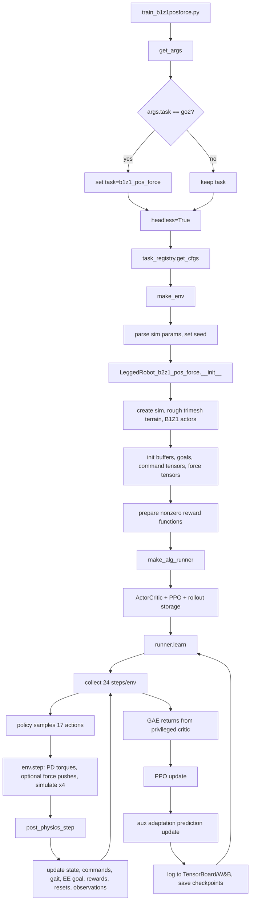

# B1+Z1 Unified Position/Force Policy Training Trace

This trace starts from `legged_gym/scripts/train_b1z1posforce.py` and follows the registered `b1z1_pos_force` task. Despite the env filename, B1+Z1 uses the shared `LeggedRobot_b2z1_pos_force` class with `B1Z1PosForceRoughCfg`.

## Entrypoint And Training Flow

`train_b1z1posforce.py`:

1. Imports all env registrations from `legged_gym.envs`.
2. Parses CLI args with `get_args()`.
3. If the task name is still the default `go2`, remaps it to `b1z1_pos_force`.
4. Forces `args.headless = True`.
5. Loads env/train configs through `task_registry.get_cfgs`.
6. Optionally flattens terrain if `--flat_terrain` is set.
7. Builds the Isaac Gym env with `task_registry.make_env`.
8. Builds `ppo_cse_pf.OnPolicyRunner` with `task_registry.make_alg_runner`.
9. Calls `learn(max_iterations=60000, init_at_random_ep_len=True)`.

The task is registered in `legged_gym/envs/__init__.py` as:

```python
task_registry.register(
    "b1z1_pos_force",
    LeggedRobot_b2z1_pos_force,
    B1Z1PosForceRoughCfg(),
    B1Z1PosForceRoughCfgPPO(),
)
```

Flow chart:



## Robot, Control, Simulation

- Asset: `resources/robots/b1z1_current/urdf/b1z1.urdf`.
- Env count: inherits base default `4096`.
- Episode length: `20 s`.
- Isaac Gym sim dt: `0.005 s`; control decimation `4`, so policy dt is `0.02 s` or `50 Hz`.
- Actions: `17` learned action dimensions, covering 12 quadruped joints plus 5 Z1 arm joints. The two gripper joints are not learned actions; they are held near default by fixed PD terms.
- Torque interface: actions are interpreted as position offsets. Torques are:
  - learned joints: `p_gains * (action * motor_strength * 0.25 + default_pos - dof_pos) - d_gains * dof_vel`
  - gripper joints: fixed target-default PD
  - clipped to URDF torque limits.
- PD gains:
  - legs: hip/thigh/calf stiffness `80`, damping `2`
  - arm: waist/shoulder/elbow/wrist/forearm/wrist-rotate/gripper stiffness `64/128/64/64/64/64/64`, damping `1.5/3.0/1.5/...`
- Terrain: trimesh rough-flat terrain, height range `[0.00, 0.05]`, no terrain curriculum.

## Command Representation

The command tensor has 15 dimensions:

| Index | Meaning |
| --- | --- |
| 0 | base linear velocity x |
| 1 | base linear velocity y |
| 2 | base yaw angular velocity |
| 3 | EE spherical radius command |
| 4 | EE spherical pitch command |
| 5 | EE spherical yaw command |
| 6 | EE roll delta command |
| 7 | EE pitch delta command |
| 8 | EE yaw delta command |
| 9 | commanded/local EE force x |
| 10 | commanded/local EE force y |
| 11 | commanded/local EE force z |
| 12 | commanded/local base force x |
| 13 | commanded/local base force y |
| 14 | commanded/local base force z |

Base velocity commands are resampled every `5 s`:

- `lin_vel_x`: `[-0.6, 0.6]`
- `lin_vel_y`: `[-0.4, 0.4]`
- `ang_vel_yaw`: `[-0.6, 0.6]`
- 30% chance to zero all velocity commands.
- Small commands are snapped to zero using clips: `x < 0.1`, `y < 0.1`, yaw `< 0.2`.

End-effector position is commanded in a sphere around a yaw-aligned center offset from the robot base:

- center offset: `[0.3, 0.0, 0.70]`
- radius range: `[0.40, 0.85]`
- pitch range: `[-pi/3, pi/3]`
- yaw range: `[-pi/2, pi/2]`
- trajectory duration: random `1-3 s`
- hold time: random `0.5-2 s`
- collision checks reject paths through a local bounding box or below `z=-0.7`.

### Unique EE-Position Representation

The paper describes the quadrupedal manipulator command as a unified vector covering base velocity, end-effector position, end-effector force, and base force commands. In this codebase, the end-effector position part is represented as a **body-yaw-aligned spherical command**, not as world-frame xyz or arm-joint targets.

The command triplet is:

```text
[l, pitch, yaw]
```

where:

- `l` is the radial reach from a moving spherical-center point near the arm mount.
- `pitch` is the vertical elevation angle.
- `yaw` is the horizontal angle around that spherical center.

Conversion to local Cartesian is:

```text
x = l * cos(pitch) * cos(yaw)
y = l * cos(pitch) * sin(yaw)
z = l * sin(pitch)
```

That local vector is then rotated only by the robot base yaw and added to a moving center:

```text
center_world = [base_x, base_y, 0] + yaw_rotation(base_quat) * [0.3, 0.0, 0.70]
ee_goal_world = center_world + yaw_rotation(base_quat) * sphere2cart([l, pitch, yaw])
```

So the command frame follows the robot in translation and yaw, but it is intentionally insensitive to robot roll/pitch. That makes the manipulator goal stable relative to where the robot is facing while avoiding the target swinging around when the quadruped body rocks on rough terrain.

The code also derives a default EE orientation from this same spherical command:

```text
default_yaw = atan2(goal_y, goal_x)
default_pitch = -sphere_pitch + arm_induced_pitch
goal_orientation = [roll=pi/2 + delta_roll,
                    pitch=default_pitch + delta_pitch,
                    yaw=default_yaw + delta_yaw]
```

In short: the policy receives an EE command that is closer to “reach this distance, elevation, and bearing from the shoulder/workspace center” than “put the gripper at this xyz point.” This is useful for loco-manipulation because the arm workspace is naturally radial around its mount, the command limits are easy to sample safely, and whole-body motion can expand the reachable workspace while the command remains compact and body-relative.

Force commands are produced by scheduled force-push logic rather than ordinary command resampling. B1 config enables gripper and base force command machinery, but the current `step()` only calls `_push_gripper`; `_push_robot_base` is commented out. This means base-force command rewards/observations are still represented, but commanded base-force events are not actively applied unless that line is re-enabled or commands are injected externally.

### Force Randomization After `force_start_step * 24`

The gripper force curriculum is gated in `step()`:

```python
if self.global_steps > self.cfg.commands.force_start_step * 24:
    self._push_gripper(torch.arange(self.num_envs, device=self.device))
```

For B1+Z1, `force_start_step = 8000`, so gripper force randomization starts only after `192000` policy steps. With a `50 Hz` policy rate, that is about `3840 s` of aggregate per-env simulated time. Because this check sits inside the control-decimation loop, `_push_gripper` is called during each of the 4 physics substeps once the gate opens, while `global_steps` itself increments once per policy step.

There are two independent gripper-force streams:

| Stream | Tensor | Applied to simulator? | Written into command vector? | Purpose |
| --- | --- | --- | --- | --- |
| Commanded gripper force | `current_Fxyz_gripper_cmd` | Indirectly through force-aware target/reward, not directly assigned to `self.forces` | Yes, `commands[9:12]` | Force command latent the policy can observe and compensate for. |
| External gripper disturbance | `force_target_gripper_ext` / `self.forces[:, gripper_idx, :]` | Yes, through `gym.apply_rigid_body_force_tensors` | No | Unobserved/random external force perturbation applied to the gripper body. |

Both streams are scheduled per environment:

- Candidate envs are selected when `episode_length_buf % push_interval == 0`.
- Initial interval is randomized per env from `3.5-9.0 s`, converted to policy steps by dividing by `dt=0.02`.
- Target force xyz components are sampled independently and uniformly from `[-60, 60] N`.
- Force duration is sampled from `1.0-3.0 s`, also converted to policy steps.
- Duration is clipped to at most half of `(interval - settling_time)`, where gripper settling time is `1.0 s`.
- Each candidate has an 80% chance of being force-controlled. The code names the opposite case `freed_envs_*`; those envs are immediately reset to zero force/command for that stream.

The time profile is triangular with a hold/settling gap:

1. Ramp up from zero to the sampled target over `push_duration`.
2. Keep the target state during a `settling_time_force_gripper` window.
3. Ramp down from target back to zero over the same `push_duration`.
4. Reset stream state and sample the next interval.

For the commanded stream, the ramped force is written into `commands[9:12]` as local EE force components:

```text
commands[9]  = current_Fxyz_gripper_cmd_x
commands[10] = current_Fxyz_gripper_cmd_y
commands[11] = current_Fxyz_gripper_cmd_z
```

This affects the policy input directly and also changes the force-aware EE position target used by `tracking_ee_force_world`:

```text
target_offset_world = actual_external_gripper_force + yaw_rotation(base) * commanded_gripper_force
force_shifted_ee_goal = nominal_ee_goal_world + target_offset_world / gripper_force_kp
```

For the external disturbance stream, the ramped force is assigned to:

```text
self.forces[env_id, gripper_idx, 0:3]
```

and then applied in global/world space through Isaac Gym. This stream changes the measured/applied force channels and physically perturbs the robot, but it is not written to `commands[9:12]`.

Force-gain randomization also supports this mechanism. At reset and command-resample events, `_randomize_dof_props` samples gripper force gains, although B1 config currently makes the ranges deterministic:

- `gripper_force_kp_range = [200, 200]`
- `gripper_prop_kd = 0.1`, so `gripper_force_kd = 20`
- `gripper_force_kd_range = [3, 3]` is bypassed because proportional KD is enabled

So the implementation is structurally randomized, but the provided B1 config fixes the gripper force gains unless those ranges are widened.

## Observations And Privileged State

Actor observation:

- Single frame: `73` values.
- History stack: `32`, so policy actor input is `2336`.
- Per-frame contents:
  - roll/pitch body orientation: `2`
  - base angular velocity: `3`
  - non-gripper joint position errors: `17`
  - non-gripper joint velocities: `17`
  - previous actions: `17`
  - gait phase sine/cosine: `2`
  - scaled 15D command vector: `15`

Auxiliary prediction target, `obs_pred`, is `12` values:

- base linear velocity: `3`
- current EE spherical position: `3`
- local EE force: `3`
- local base force: `3`

Critic observation:

- Single privileged frame: `149`.
- Stack: `3`, so critic input is `447`.
- Contains actor-like state plus privileged items: base linear velocity, current EE spherical state, local applied forces, leg reference error, mass/randomized COM parameters, friction, motor strengths, stance/contact masks, gravity projection, and force-offset EE goal information.

Observation noise is applied only to actor observations before history stacking. It affects roll/pitch, angular velocity, joint positions, and joint velocities; commands and previous actions are not noised.

## Policy And PPO Architecture

Training uses `legged_gym/b2_gym_learn/ppo_cse_pf`.

ActorCritic:

- Adaptation encoder:
  - input: full stacked actor obs, `2336`
  - hidden dims: `[512, 256, 128]`
  - output latent dim: `frame_stack * 2 = 64`
- Adaptation decoder:
  - input: latent `64`
  - hidden dims: `[128, 64]`
  - output: `12` predicted privileged quantities
- Actor body:
  - input: latest actor frame `73` concatenated with latent `64`, total `137`
  - hidden dims: `[512, 256, 128]`
  - output: Gaussian mean over 17 actions
  - learned global action std initialized to `1.0`
- Critic body:
  - input: privileged obs `447`
  - hidden dims: `[512, 256, 128]`
  - output: scalar value
- Activation: ELU.

PPO:

- `num_steps_per_env = 24`
- `num_learning_epochs = 5`
- `num_mini_batches = 4`
- `clip_param = 0.2`
- `gamma = 0.99`
- `lam = 0.95`
- `learning_rate = 1e-3`
- adaptive KL schedule with desired KL `0.01`
- entropy coefficient overridden to `0.005`
- clipped value loss enabled
- max grad norm `1.0`

Auxiliary adaptation update:

- After each PPO minibatch update, the code separately trains the adaptation encoder/decoder to predict `obs_pred`.
- Prediction labels and dimensions:
  - `base_velocity_loss`: `3`, weight `0.2`
  - `gripper_pos_loss`: `3`, weight `0.2`
  - `force_ee_loss`: `3`, weight `1.0`
  - `force_base_loss`: `3`, weight `1.0`
- Learning rate: `1e-5`.
- Note: the adaptation optimizer is constructed over all actor-critic parameters, not just the encoder/decoder, so this auxiliary loss can also update actor/critic parameters even though the comment says it should only update the concurrent state estimation module.

## Active Reward Functions

The env activates every non-zero scale in `B1Z1PosForceRoughCfg.rewards.scales`, then multiplies the scale by `dt=0.02`.

| Reward | Raw scale | What it computes |
| --- | ---: | --- |
| `termination` | `-1.0` | Penalty for reset events except timeouts. Added separately after other rewards. |
| `feet_contact_number` | `2.0` | Rewards contact pattern matching gait stance mask; mismatch gets `-0.3`. |
| `tracking_lin_vel_force_world` | `2.0` | Tracks base xy velocity, offset by local base force and commanded base force divided by randomized base force damping. |
| `tracking_ang_vel` | `1.0` | Exponential tracking of yaw-rate command. |
| `torques` | `-5e-6` | Squared leg torques, first 12 joints. |
| `stand_still` | `0.5` | At zero walking command, rewards closeness of leg joints to default pose. |
| `ref_dof_leg` | `1.0` | Rewards closeness of leg joints to sinusoidal trot reference, regardless of command. |
| `alive` | `1.5` | Constant survival reward. |
| `lin_vel_z` | `-1.5` | Penalizes vertical base velocity. |
| `feet_air_time` | `1.0` | Rewards long steps on first foot contact, only while walking. |
| `feet_height` | `1.0` | Penalizes front-foot swing height below `0.10 m`, only while walking. |
| `ang_vel_xy` | `-0.02` | Penalizes roll/pitch angular velocity. |
| `dof_acc` | `-2.5e-7` | Penalizes leg joint acceleration. |
| `dof_vel` | `-8e-4` | Penalizes leg joint velocity. |
| `dof_acc_arm` | `-4.5e-7` | Penalizes arm joint acceleration. |
| `dof_vel_arm` | `-2e-4` | Penalizes arm joint velocity. |
| `collision` | `-5.0` | Penalizes contacts on configured thigh/calf/trunk bodies. |
| `action_rate` | `-0.02` | Penalizes leg action changes. |
| `action_rate_arm` | `-0.045` | Penalizes arm action changes. |
| `dof_pos_limits` | `-10.0` | Penalizes positions outside softened DOF limits for first 17 joints. |
| `torque_limits` | `-0.005` | Penalizes torque above 90% of torque limit. |
| `hip_pos` | `-0.5` | Penalizes hip joints deviating from default. |
| `feet_drag` | `-0.0008` | Penalizes foot velocity weighted by contact force. |
| `feet_contact_forces` | `-0.001` | Penalizes foot contact force above `200 N`. |
| `base_height` | `-2.0` | Penalizes base height away from `0.50 m`. |
| `feet_pos_xy` | `-0.5` | Penalizes horizontal distance between feet and corresponding thighs. |
| `feet_height_high` | `-15.0` | Penalizes feet higher than `0.20 m`, only while walking. |
| `roll` | `-0.25` | Penalizes absolute base roll. |
| `tracking_ee_force_world` | `2.0` | Tracks EE position target offset by external and commanded EE forces divided by randomized EE force stiffness. |

Several reward functions exist but are inactive because their scales are zero, including direct EE spherical/cartesian/orientation tracking terms, arm orientation, and arm energy terms.

## Gait And Reference Motion

The locomotion reference is a hand-coded trot phase:

- Cycle time: `0.64 s`.
- Gait phase only advances while walking commands exceed the configured deadbands.
- Stance mask:
  - FL/RR stance when `sin(phase) + target_joint_pos_thd >= 0`
  - FR/RL stance when `sin(phase) - target_joint_pos_thd < 0`
- `target_joint_pos_thd = 0.5` creates a double-support region.
- Reference leg DOF motion modifies thigh and calf joints with `target_joint_pos_scale = 0.17`; hip joints stay near default.

## Non-Standard Or Unusual Training Details

- Unified base-arm command vector: locomotion, EE spherical position/orientation, EE forces, and base forces share one command tensor.
- Force-aware position tracking: EE and base velocity tracking can be shifted by virtual force offsets, effectively blending admittance-like behavior into reward targets.
- Scheduled force events: force commands are generated internally via ramp-up, settling, and ramp-down windows. Gripper forces are actually applied in `step()` after `force_start_step * 24`; base force logic exists but is currently not called.
- Force start threshold: `force_start_step = 8000`, and the code compares `global_steps > force_start_step * 24`, so gripper force pushing starts after roughly `192000` policy steps, not after 8000 steps.
- Asymmetric actor-critic: actor receives noisy stacked proprioception/commands; critic receives privileged randomization, contact, force, and velocity state.
- Concurrent state estimation: adaptation encoder/decoder predicts privileged quantities from actor history, with force prediction weighted more heavily than velocity/EE-position prediction.
- Actor sees only latest frame plus latent: the adaptation encoder consumes the full 32-frame history, but the actor body uses only the latest 73D frame concatenated with the latent.
- Reward totals are not clipped positive: `only_positive_rewards = False`.
- Domain randomization is substantial: friction, base mass, base COM, gripper mass, motor strength, randomized force gains, terrain origins, initial yaw, initial DOF positions, and push velocities.
- Contact term ordering is explicitly aligned to the gait phase by `_ordered_limb_body_names`.
- `ActorCritic.act_teacher` appears inconsistent with the actor architecture because it feeds critic observations directly into `actor_body`, whose input is latest actor obs plus latent. This path appears unused by `OnPolicyRunner.learn`, which uses `act()` and adaptation latents.
- `action_delay` is parsed but not used in the shown training step.

## Conversion Steps For Genesis-Compatible PACT-Like Coupled-Torque PINN Training

## Implementing Combined Position/Force Control

The UniFP paper frames combined force/position control as an impedance-like transformation from a nominal position command and a force command into a force-aware target. For the end effector, the simplified slow-manipulation form is:

```text
F = K * (x - x_des)
x_target = x_cmd + (F_ext + (F_cmd - F_react)) / K
```

For the robot base, the analogous version shifts velocity rather than position:

```text
F_base = D * (v_base - v_base_des)
v_base_target = v_base_cmd + (F_base_ext + (F_base_cmd - F_base_react)) / D
```

In this codebase, the implementation is a training-time approximation of that idea:

- `x_cmd` is the nominal EE spherical command converted to a world-space goal.
- `F_cmd` is the internally scheduled commanded EE force in `commands[9:12]`.
- `F_ext` is the external disturbance assigned to `self.forces[:, gripper_idx, :]`.
- `K` is `gripper_force_kps`.
- The reward `tracking_ee_force_world` tracks:

```text
x_target = x_cmd_world + (F_ext_world + yaw_rotation(base) * F_cmd_local) / K
```

The policy is still a joint-position-target policy. It does not output force or torque directly. Instead, it observes the force command and historical state, predicts force-related privileged quantities through the adaptation decoder, and learns actions that make the PD-controlled body behave as if it were doing combined force/position control.

### How To Implement The External Impedance-Like Controller

For a clean Genesis baseline that preserves UniFP behavior, implement the impedance/admittance wrapper outside the policy:

1. Keep the high-level command:

```text
c = [v_base_cmd, x_ee_cmd, F_ee_cmd, F_base_cmd]
```

2. Estimate or read the current interaction force:

```text
F_hat_ee = measured_contact_force
          or privileged simulator force
          or policy-estimated force from history
```

3. Compute an admittance-style offset:

```text
delta_x_ee = S_pos * (F_ext_hat + F_cmd - F_react_hat) / K_ee
x_ee_target = x_ee_cmd + delta_x_ee
```

where `S_pos` can be an axis selector, e.g. stiff in tangential axes and compliant along the contact normal.

4. For base motion:

```text
delta_v_base = S_base * (F_base_ext_hat + F_base_cmd - F_base_react_hat) / D_base
v_base_target = v_base_cmd + delta_v_base
```

5. Feed the shifted target back into the policy command vector, or keep the nominal command in the actor input and use the shifted target only in rewards. For a faithful UniFP baseline, use the repo’s current choice: actor sees nominal position plus force command; reward tracks the shifted target.

This supports the common modes:

| Mode | Commands | Behavior |
| --- | --- | --- |
| Position control | `F_cmd = 0`, high `K` | Track EE position tightly. |
| Force application | nonzero `F_cmd`, target near/inside contact surface | Shift target so the position controller pushes into the environment. |
| Compliance | nonzero/estimated `F_ext`, moderate or low `K` | External force moves the target, so the EE yields. |
| Hybrid control | axis selector `S` | Some axes track position; others regulate force/compliance. |

### Genesis UniFP Baseline

To train a UniFP-style baseline in Genesis, preserve the current control abstraction first:

1. Port the B1+Z1 asset and indexing:
   - body names: feet, thighs, trunk/base, gripper
   - DOF order: 12 legs, 5 arm actions, 2 gripper joints
   - torque limits, mass/inertia, collision geometry, and default pose

2. Rebuild the vectorized environment:
   - policy dt `0.02 s`
   - sim dt `0.005 s`
   - 4 physics substeps per policy action
   - batched reset, root state, DOF state, rigid-body state, and contact-force APIs

3. Preserve the current action mode:
   - policy outputs 17 normalized position offsets
   - Genesis computes PD torques from those offsets
   - gripper joints remain fixed by non-learned PD unless you explicitly add them to the action space

4. Port the command/force scheduler:
   - 15D command vector
   - body-yaw-aligned spherical EE command
   - internal commanded EE force stream
   - external EE disturbance stream
   - optional base force stream, making an explicit choice about the currently commented `_push_robot_base`

5. Port the rewards exactly:
   - `tracking_ee_force_world`
   - `tracking_lin_vel_force_world`
   - all locomotion/gait regularizers
   - force/contact penalties
   - same scales and `dt` multiplication

6. Keep the asymmetric architecture:
   - actor: 32-frame noisy proprioceptive history plus commands
   - critic: 3-frame privileged state
   - auxiliary prediction target: base velocity, EE spherical position, EE force, base force

This gives a baseline that answers: “How well does UniFP’s indirect force-control-through-position-PD work when implemented in Genesis?”

### Coupled-Torque PINN Policy Direction

Your proposed direction replaces two things:

1. the external impedance-like target shifter
2. the indirect force control produced by modulating PD position targets

The clean replacement is to make the policy output coupled joint torques, then regularize those torques with physics and force-consistency losses.

Recommended action definition:

```text
a_t = tau_policy in R^17
tau_cmd = tau_limit * tanh(a_t)
```

Optionally include the gripper:

```text
tau_cmd in R^19
```

if grasp/contact dynamics through the gripper matter for the task.

The Genesis `step()` should then:

1. read `tau_cmd` from the policy
2. optionally add a low-level stabilizing residual or safety clamp
3. apply torques directly to the actuated DOFs
4. step Genesis
5. expose accelerations, contact forces, Jacobians, mass matrix/inverse dynamics terms if available

The PINN-style regularization can use residuals like:

```text
r_dyn = M(q) qdd + C(q, qd) qd + g(q)
        - tau_cmd
        - J_contact(q)^T lambda_contact
        - J_ee(q)^T F_ee_ext
```

and:

```text
L_dyn = ||r_dyn||^2
L_tau = ||tau_cmd - tau_inverse_dynamics||^2
L_ee = ||J_ee(q) qd - xdot_ee||^2
L_force = ||F_ee_hat - F_ee_priv||^2
L_contact = penetration/contact-complementarity residual
L_energy = positive-work or passivity regularizer under external disturbances
```

You do not need all of these at full strength from day one. A stable schedule would be:

1. train torque policy with RL rewards and torque penalties
2. add supervised privileged prediction losses
3. add low-weight dynamics residuals
4. increase contact/force residual weight after the policy can stand and reach

### DACT/PACT-Like Privileged And State Prediction

A good architecture for your version:

```text
history_encoder(o[t-H:t]) -> z_hist
privileged_encoder(privileged_state) -> z_priv        # training only
force_disturbance_encoder(history) -> z_force
FiLM(z_force) -> gamma,beta modulation of actor blocks
actor(o_t, z_hist, force_pred, gamma,beta) -> tau_cmd
critic(privileged_obs, z_priv) -> V
state_decoder(z_hist) -> [base_vel, ee_pos, ee_wrench, base_wrench, contacts, actuator_health]
```

Training losses:

```text
L = L_PPO
  + w_state * L_state_prediction
  + w_dist * L_force_disturbance_prediction
  + w_priv * ||z_hist - stopgrad(z_priv)||^2
  + w_dyn * L_PINN_dynamics
  + w_force * L_force_consistency
  + w_smooth * L_torque_smoothness
```

This preserves the useful UniFP idea that force can be inferred from history, but moves the compensation from “shift position target, let PD discover the torque” to “infer force/disturbance and directly generate coupled torques.”

### Force-Disturbance FiLM Module

The DreamFLEX-like idea maps nicely onto UniFP force disturbances:

1. Build a disturbance estimator:

```text
d_hat = f_disturbance(o[t-H:t], c[t-H:t], a[t-H:t])
```

Useful predicted labels in Genesis:

- EE external force, local and world
- base external force/wrench
- contact body id or contact mask
- contact normal
- force onset/decay phase
- actuator strength/failure vector if you randomize faults

2. Convert `d_hat` into FiLM parameters:

```text
gamma_l, beta_l = MLP_l(d_hat)
h_l = gamma_l * h_l + beta_l
```

3. Apply FiLM to selected actor layers, not necessarily every layer. A good first version modulates the middle actor layer and the torque head.

4. Train it with both supervised labels and RL pressure:

```text
L_dist = MSE(F_ee_hat, F_ee_priv)
       + MSE(F_base_hat, F_base_priv)
       + BCE(contact_hat, contact_priv)
       + MSE(actuator_fault_hat, actuator_fault_priv)
```

For your novelty, the “fault vector” becomes a more general “disturbance/force condition vector” that modulates torque generation.

### Codebase Changes Needed

For a Genesis UniFP baseline:

- Add a Genesis env equivalent of `LeggedRobot_b2z1_pos_force`.
- Port `B1Z1PosForceRoughCfg` to a simulator-agnostic config or a Genesis config.
- Recreate `compute_observations`, `_resample_commands`, `_resample_ee_goal`, `_push_gripper`, `_push_robot_base`, and all active rewards.
- Replace Isaac Gym tensor calls with Genesis batched state/contact/force APIs.
- Keep `ppo_cse_pf` mostly unchanged at first.
- Add a simulator abstraction so `OnPolicyRunner` only requires `reset`, `step`, `get_observations`, `num_obs`, `num_privileged_obs`, `num_pred_obs`, `num_actions`, and `max_episode_length`.

For the coupled-torque/PINN policy:

- Change `num_actions` from position targets to torque actions.
- Replace `_compute_torques(actions)` with direct torque scaling and safety clipping.
- Add privileged labels for dynamics:
  - `qdd`
  - mass/inertia or inverse dynamics terms
  - contact forces/Jacobians
  - EE/base wrench
  - actuator strength/fault parameters
- Extend rollout storage to save any tensors needed for PINN losses.
- Replace `ActorCritic` with a modular actor:
  - history encoder
  - state estimator
  - disturbance FiLM module
  - torque actor head
  - privileged critic
- Fix the adaptation optimizer so it updates only estimator/encoder parameters unless you intentionally want auxiliary losses to update the actor.
- Add loss logging by group: PPO, state prediction, force prediction, dynamics residual, contact residual, torque smoothness.

### Suggested Experimental Matrix

Train these in Genesis in order:

| Experiment | Action | Force handling | Purpose |
| --- | --- | --- | --- |
| A | PD position targets | no force shift | plain position-control baseline |
| B | PD position targets | UniFP force-shifted targets | faithful UniFP baseline |
| C | direct torques | UniFP rewards only | isolate torque-action difficulty |
| D | direct torques | state prediction + force prediction | DACT/PACT-like estimator benefit |
| E | direct torques | prediction + PINN residuals | coupled-torque physics benefit |
| F | direct torques | prediction + PINN + force FiLM | test disturbance modulation novelty |

This matrix keeps the comparison honest: each new mechanism has one clear incremental difference.

### Practical Risks

- Direct torque policies are harder to stabilize than PD target policies; start with tight torque limits and strong smoothness penalties.
- PINN losses can fight PPO early. Warm them in after standing/reaching emerges.
- Contact forces in simulation can be noisy. Low-pass labels or predict integrated impulse/wrench over a short window.
- If you remove the impedance wrapper entirely, you need rewards or losses that still define what “combined force and position control” means. Use task-space force/position residuals explicitly, not only joint torque residuals.
- For baseline fairness, keep command distributions, force ranges, terrain, resets, and observation history identical between Genesis UniFP and your torque/PINN policy.

## Genesis PACT Reassessment For B1+Z1

This reassessment uses the existing `go2_pact` implementation in `HCR_Genesis_PACT_Development` as the target framework. The useful starting point is that `go2_pact` already has most of the PACT-like structure needed for B1+Z1:

- `ActorCritic_PACT` outputs `2 * num_actions`.
- The first half is a PD position-target branch.
- The second half is a feedforward torque branch.
- `GenesisSimulator_PACT._compute_torques` blends them:

```text
tau = feedforward_tau_weight * tau_ff
    + feedback_tau_weight * tau_pd
```

For Go2, `num_actions = 12`, so the policy outputs 24 actions. For B1+Z1, the natural analog is:

```text
34 = 17 position targets + 17 feedforward torques
```

If the two gripper joints need to be dynamically controlled rather than held by fixed PD, use:

```text
38 = 19 position targets + 19 feedforward torques
```

Start with 34 to match UniFP's learned action surface.

### Existing PACT PINN Loss

The current `go2_pact` PINN loss is a relative whole-body inverse-dynamics residual. For Go2:

```text
whole_body_dim = 18 = 6 floating-base coordinates + 12 actuated joints
```

The loss computes:

```text
q_des, tau_ff = action_func(current_actions)
tau_pd = fb_func(q_des, q, qd)

qdd = finite_difference(qd)
wb_acc = [torso_6dof_acc, qdd_joints]
wb_tau = [0_6, tau_ff + tau_pd]

model_dyn = M(q) wb_acc + bias(q, qd)
error = model_dyn - generalized_contact_forces - wb_tau
loss = mean(||error|| / (||wb_tau|| + ||generalized_contact_forces|| + eps))
```

For B1+Z1, extend this to:

```text
whole_body_dim = 23 = 6 floating base + 17 controlled joints
```

or to `25` if the two gripper joints are included in the generalized dynamics.

### Updating The PINN Loss For Arm And EE Forces

The B1+Z1 residual should make the EE wrench explicit:

```text
r_wb = M(q) qdd + h(q, qd)
       - S^T tau_policy
       - J_feet(q)^T lambda_feet
       - J_ee(q)^T F_ee
       - J_base(q)^T W_base_ext
```

Where:

- `M` is the B1+Z1 whole-body mass matrix.
- `h` is gravity, Coriolis, and centrifugal bias.
- `S^T tau_policy` maps actuated joint torques into generalized coordinates.
- `J_feet^T lambda_feet` is the existing foot-contact generalized force term.
- `J_ee^T F_ee` is the new manipulator/contact term.
- `F_ee` should ideally be a 6D wrench `[force_xyz, torque_xyz]`. A 3D force-only label is an acceptable first version.
- `J_ee` should be the floating-base Jacobian of the EE link, not just an arm-only Jacobian, because EE force loads the base and legs.

Extend the current PACT data path:

```text
gt_forces, mass_mats, bias_vecs, torso_acc = env.get_pinn_wb_dynamics()
```

to something like:

```text
wb_contact_forces, mass_mats, bias_vecs, torso_acc,
ee_wrench, ee_jacobian, base_wrench = env.get_pinn_wb_dynamics()
```

Then compute:

```text
tau_gen = [0_6, tau_joints]
ee_gen_force = J_ee^T F_ee
feet_gen_force = existing_contact_generalized_forces

r = M qdd + h - tau_gen - feet_gen_force - ee_gen_force
```

Do not hide the EE wrench inside a generic `gt_forces` vector without also logging it separately. Separate diagnostics will matter:

- whole-body residual
- feet contact residual
- EE wrench residual
- arm joint residual
- base wrench residual

### Additional PINN Losses Beyond Whole-Body Dynamics

Add these as separate losses, then combine them with explicit weights.

**EE Task-Space Kinematics/Dynamics**

```text
xdot_ee_pred = J_ee(q) qd
xddot_ee_pred = J_ee(q) qdd + Jdot_ee(q, qd) qd

L_ee_kin = ||xdot_ee_meas - xdot_ee_pred||^2
         + ||xddot_ee_meas - xddot_ee_pred||^2
```

If operational-space dynamics are available:

```text
r_ee = Lambda_ee(q) xdd_ee + mu_ee(q, qd) + p_ee(q) - F_ee
L_ee_dyn = ||r_ee||^2
```

**EE Wrench Prediction**

Train the history/disturbance estimator to predict privileged EE wrench:

```text
F_ee_hat = f(history)
L_ee_force = ||F_ee_hat - F_ee_priv||^2
```

Use both local-yaw and world-frame labels if possible. Local-yaw helps invariance; world-frame is cleaner for dynamics.

**Hybrid Force/Position Constraint**

Instead of using UniFP's impedance equation as an external controller, use it as a soft consistency loss:

```text
r_imp = K_ee (x_ee - x_cmd) - (F_ext + F_cmd - F_react)
L_imp = ||r_imp||^2
```

This keeps the combined force/position objective but lets the policy learn direct coupled torques rather than receiving a shifted target from an external impedance wrapper.

**Arm-Base Coupling**

EE force should induce base wrench and leg compensation. Penalize the base slice of the residual:

```text
r_base = [M qdd + h - tau - J_feet^T lambda_feet - J_ee^T F_ee]_{base_6d}
L_base_coupling = ||r_base||^2
```

**Joint-Torque Consistency**

Compare policy torque to inverse-dynamics torque implied by motion and contacts:

```text
tau_id = [M qdd + h - J_feet^T lambda_feet - J_ee^T F_ee]_{actuated}
L_tau_id = ||tau_policy - tau_id||^2
```

This becomes more important as the feedback PD branch is reduced.

**Contact Complementarity**

For feet and, optionally, EE contact:

```text
lambda_n >= 0
penetration <= 0
lambda_n * penetration ~= 0
```

Practical loss:

```text
L_contact = ReLU(-lambda_n)^2
          + ReLU(foot_or_ee_penetration)^2
          + |lambda_n * clearance|
```

**Passivity/Energy**

To avoid unstable energy injection during contact:

```text
P = tau^T qd + F_ee^T xdot_ee
L_passive = ReLU(P - P_max)^2
```

Use this gently; too much passivity pressure can suppress purposeful manipulation.

**Force-Disturbance FiLM Prediction**

A DreamFLEX-like branch can estimate a disturbance vector:

```text
d_hat = [F_ee, W_base, contact_mask, contact_normal, actuator_faults]
```

Then FiLM-modulate actor features:

```text
h_l = gamma(d_hat) * h_l + beta(d_hat)
```

Training loss:

```text
L_dist = MSE(F_ee_hat, F_ee)
       + MSE(W_base_hat, W_base)
       + BCE(contact_hat, contact)
       + MSE(fault_hat, fault_priv)
```

For this project, the DreamFLEX-style fault vector becomes a broader force/disturbance condition vector that modulates torque generation.

### Porting UniFP To Genesis As Baseline

Keep this baseline separate from the novel torque/PINN formulation.

1. Create a Genesis `b1z1_unifp` environment by copying the structure of `go2_pact`, but initially keep UniFP's PD position-target action mode.

2. Port the B1+Z1 asset:
   - URDF from UniFP
   - body names for trunk, feet, thighs, and gripper
   - DOF order
   - default poses
   - torque limits

3. Match UniFP observations:
   - 73D actor frame
   - 32-frame actor history
   - 149D privileged frame
   - 3-frame privileged stack
   - 12D prediction target: base velocity, EE spherical position, EE force, base force

4. Port the command representation:
   - 15D command vector
   - spherical EE command `[radius, pitch, yaw]`
   - yaw-aligned workspace center
   - commanded EE force stream
   - external EE force stream
   - explicit decision on whether to enable base-force pushing, since UniFP has `_push_robot_base` implemented but commented out in `step`

5. Port rewards:
   - `tracking_ee_force_world`
   - `tracking_lin_vel_force_world`
   - locomotion/gait rewards
   - force/contact penalties
   - same scale-by-`dt` behavior

6. Preserve UniFP combined control:
   - policy outputs position targets
   - external impedance-like force shift exists in reward target
   - no direct torque policy requirement

This produces a fair Genesis baseline: UniFP's indirect force-control-through-position-PD behavior in the same simulator used by the new method.

### Implementing The Novel Genesis Formulation

Branch from the baseline after it is validated.

1. Change B1+Z1 action shape from `17` to `34`:
   - 17 position target actions
   - 17 feedforward torque actions

2. Later allow torque-dominant control:
   - reduce `feedback_tau_weight`
   - increase `feedforward_tau_weight`
   - optionally keep a small stabilizing PD residual

3. Set whole-body dimension:
   - start with `wb_dim = 23`
   - evaluate `wb_dim = 25` only if gripper passive dynamics matter

4. Extend Genesis/Pinocchio PACT buffers:
   - EE wrench
   - EE Jacobian
   - EE pose, velocity, acceleration
   - optional base wrench
   - optional arm-only mass/bias terms

5. Extend rollout storage:
   - EE wrench labels
   - EE Jacobian labels
   - command force/position labels
   - disturbance/fault labels for FiLM

6. Extend actor:
   - keep the current PACT history encoder
   - add force-disturbance encoder
   - add FiLM modulation to actor trunk or torque head
   - keep privileged critic

7. Extend losses:
   - PPO loss
   - VAE/history reconstruction loss
   - updated whole-body residual with EE wrench
   - EE wrench prediction
   - hybrid force/position consistency
   - joint inverse-dynamics torque consistency
   - contact complementarity
   - passivity/energy regularization

8. Use a staged curriculum:
   - train PD-position UniFP baseline
   - enable feedforward torque branch with small scale
   - add whole-body PINN residual
   - add EE wrench residual
   - remove or reduce impedance-wrapper influence
   - reduce PD feedback weight
   - train torque-dominant policy with FiLM disturbance modulation

### Clean Experimental Matrix

| ID | Policy | Force/position mechanism | Purpose |
| --- | --- | --- | --- |
| A | UniFP PD | no force shift | Position-only Genesis baseline. |
| B | UniFP PD | impedance-like shifted EE target | Faithful UniFP Genesis baseline. |
| C | PACT dual-head | shifted target still present | Isolate torque-head benefit. |
| D | PACT dual-head | shifted target removed, add `L_imp` | Test replacing impedance wrapper. |
| E | PACT dual-head | `L_imp + EE wrench PINN` | Test arm/EE physics regularization. |
| F | PACT dual-head + FiLM | disturbance prediction/modulation | Test the proposed force-disturbance novelty. |

The core design move is to stop treating the impedance equation as a controller in the novel method. Instead, treat it as a loss/label structure while the policy learns coupled torques directly. PINN and privileged prediction then make EE force, base response, and arm-leg coupling physically legible to the policy.

## Can The Existing Pinocchio PINN Pipeline Support Legged Manipulation?

Yes. The existing PACT PINN pipeline built around Pinocchio can be modified for B1+Z1 legged manipulation, but it needs a targeted refactor. The current implementation is not fundamentally limited to quadruped-only dynamics; it already uses a floating-base Pinocchio model, generalized mass matrix, bias vector, generalized contact forces, and shared-memory asynchronous workers. The main limitation is that its contact-force path is currently **feet-only** and assumes four 3D ground-reaction forces.

### What The Current Pipeline Already Does Well

The current worker path in `parallel_pino_workers.py`:

1. Receives per-env generalized state:

```text
q       : [base_pos, base_quat, joint_pos]
qd      : [base_world_lin_vel, base_world_ang_vel, joint_vel]
qd_prev : previous qd
grf     : 4 x 3 foot contact forces
dt
```

2. Applies base mass/COM randomization to the Pinocchio model.

3. Computes:

```text
b = rnea(model, data, q, qd, 0)
M = crba(model, data, q)
wb_dyn = M @ qdd + b
```

4. Converts foot contact forces into generalized forces:

```text
tau_contact = sum_i J_foot_i(q)^T f_foot_i
```

5. Writes shared outputs:

```text
wb_dynamics
wb_contacts
mass_mat
bias
base_6dof_acceleration
```

This is the right skeleton for B1+Z1. You do not need to throw it away.

### Required Changes For B1+Z1

**1. Build A B1+Z1 Pinocchio Model**

Load the B1+Z1 URDF into Pinocchio with a free-flyer root. The model must preserve:

- trunk/base frame
- four foot frames
- Z1 arm joints
- EE/gripper frame
- joint ordering maps between Genesis and Pinocchio

The current code already uses maps like:

```text
model_2_pino_joint_map
pino_2_model_joint_act_map
correct_idxs = [0,1,2,3,4,5] + pino_2_model_joint_act_map
```

For B1+Z1, those maps need to include the 12 leg joints plus 5 arm joints, and optionally the 2 gripper joints.

Expected generalized dimensions:

```text
nv = 23 = 6 floating base + 17 controlled joints
nq = 24 = 7 floating base config + 17 controlled joints
```

or:

```text
nv = 25
nq = 26
```

if the gripper joints are part of the dynamics.

**2. Generalize Shared Memory Beyond Foot GRFs**

Current shared memory has:

```text
grf: (num_envs, 4, 3)
```

Add EE wrench buffers:

```text
ee_wrench:       (num_envs, 6)    # preferred
ee_force:        (num_envs, 3)    # acceptable first version
ee_gen_force:    (num_envs, nv)
ee_jacobian:     (num_envs, 6, nv) # optional but useful for logging/losses
```

If you want base disturbances in the same residual, also add:

```text
base_wrench:     (num_envs, 6)
base_gen_force:  (num_envs, nv)
```

The existing `SharedTensors.keys()`, `_create_all()`, worker attachment code, and storage shapes must all be extended.

**3. Add EE Frame Jacobian Computation**

The current foot contact code uses:

```python
J = pn.computeFrameJacobian(
    model,
    data,
    q,
    foot_frame_id,
    pn.ReferenceFrame.LOCAL_WORLD_ALIGNED,
)[0:3, :]

contact_tau += J.T @ foot_force
```

For the EE, use the full 6D Jacobian if you have a wrench:

```python
J_ee = pn.computeFrameJacobian(
    model,
    data,
    q,
    ee_frame_id,
    pn.ReferenceFrame.LOCAL_WORLD_ALIGNED,
)

ee_tau = J_ee.T @ ee_wrench
```

If Genesis only gives reliable force and not torque at the gripper:

```python
J_ee_lin = J_ee[0:3, :]
ee_tau = J_ee_lin.T @ ee_force
```

Be careful about wrench ordering. Pinocchio spatial quantities commonly use linear/angular or angular/linear conventions depending on API and frame representation. Verify this once with a static unit-force test:

1. apply `+Fx` at the EE in Genesis,
2. compute `J_ee.T @ F`,
3. check that the implied arm/base torque direction matches finite differences or inverse dynamics.

**4. Extend The Worker Contact Force Sum**

The B1+Z1 worker should compute:

```text
gen_forces = feet_gen_forces + ee_gen_force + base_gen_force
```

Then the PINN residual remains structurally identical:

```text
r = M qdd + b - gen_forces - tau_actuated
```

This is the minimal change that makes arm/EE forces part of the existing whole-body residual.

**5. Mirror Relevant Domain Randomization In Pinocchio**

The current worker only mirrors base mass and base COM randomization. UniFP randomizes more:

- base mass
- base COM
- gripper mass
- motor strength
- optionally arm/leg masses
- force/admittance gains

For accurate PINN labels, at minimum mirror:

- base mass/COM
- gripper or EE link mass if randomized
- any arm link mass randomization if introduced

Motor strength does not change Pinocchio inertial dynamics, but it changes the effective actuator torque. That belongs in `tau_policy`/actuation scaling, not in the Pinocchio model.

### Proposed Pinocchio API Extension

Instead of replacing `PinocchioAsync`, make a new variant or a backward-compatible extension:

```python
PinocchioAsync(
    pino_model,
    num_envs,
    contact_frame_names=["FL_foot", "FR_foot", "RL_foot", "RR_foot"],
    ee_frame_name="ee_gripper_link",
    correct_idxs=...,
    wb_dim=23,
    contact_force_dim=(4, 3),
    ee_wrench_dim=6,
    base_joint_id=...,
)
```

Inputs:

```text
q
qd
qd_prev
foot_forces
ee_wrench
base_wrench
dt
domain_rand_inertial_params
```

Outputs:

```text
mass_mat
bias
wb_dynamics
foot_gen_forces
ee_gen_forces
base_gen_forces
total_gen_forces
ee_jacobian
base_6dof_acc
```

Then `env.get_pinn_wb_dynamics()` can return:

```text
total_gen_forces,
mass_mats,
bias_vecs,
torso_acc,
ee_wrench,
ee_jacobian,
ee_gen_forces,
foot_gen_forces
```

The current loss can continue using `total_gen_forces`, while the new loss terms use the separated EE and foot components.

### Genesis-Side Requirements

The simulator must provide, per env:

- B1+Z1 generalized pose and velocity in Pinocchio order
- previous generalized velocity
- foot contact forces in world or local-world-aligned frame
- EE force/wrench in the same frame expected by the Pinocchio Jacobian
- EE pose and velocity for task-space losses
- optional base wrench from externally applied forces

For UniFP-style force randomization, the external gripper force is already conceptually available:

```text
self.forces[:, gripper_idx, 0:3]
```

In Genesis, preserve the same distinction:

- commanded EE force: policy-observed command latent
- external EE disturbance: actual applied force/wrench
- measured/contact EE force: privileged label for estimator and PINN

### What Must Change In Rollout Storage

Current `RolloutStoragePACT` stores:

```text
wb_contact_forces
wb_mass_mats
wb_bias_vecs
torso_accelerations
```

For legged manipulation add:

```text
ee_wrenches
ee_jacobians
ee_gen_forces
foot_gen_forces
base_wrenches          # optional
ee_pose_vel_acc_labels # optional, for task-space losses
```

Keep the separated components even if you also store their sum. Without separated components, debugging the PINN loss will be miserable.

### Feasibility Assessment

The pipeline is feasible to adapt with moderate refactoring.

Low-risk parts:

- changing `wb_dim` from 18 to 23/25
- extending action dimensions from 24 to 34/38
- adding arm joints to ordering maps
- computing `M`, `b`, and `M qdd + b` for the larger model
- adding `J_ee.T @ F_ee`

Medium-risk parts:

- matching Genesis and Pinocchio joint order for the combined robot
- ensuring the EE wrench frame convention is correct
- including fixed/collapsed links consistently between Genesis and Pinocchio
- keeping async shared-memory shapes and rollout storage synchronized

High-risk parts:

- noisy or unreliable EE contact wrench labels
- mismatch between Genesis contact force reporting and Pinocchio frame assumptions
- unmirrored mass/inertia randomization causing the PINN target to be systematically wrong
- making PINN losses too strong before the torque policy can stand/reach

### Recommended Implementation Order

1. Build B1+Z1 Pinocchio model and verify `nq`, `nv`, frame names, and joint maps.

2. Reproduce Go2-style whole-body residual with B1+Z1 but no EE force:

```text
r = M qdd + b - J_feet^T lambda_feet - tau
```

3. Add arm joints to the action and residual, still with EE force zero.

4. Add EE Jacobian and log `J_ee.T F_ee`, but do not include it in the loss yet.

5. Apply a known synthetic EE force in one axis and validate generalized force signs/magnitudes.

6. Add `J_ee.T F_ee` to the whole-body residual.

7. Add separated losses:

- EE wrench prediction
- EE task-space kinematics
- hybrid force/position consistency
- arm-base coupling residual

8. Only after the above is stable, add FiLM disturbance modulation and torque-dominant curriculum.

### Bottom Line

The existing Pinocchio PINN pipeline is the right foundation. It already computes the exact kind of generalized dynamics residual needed for PACT-like torque regularization. The necessary upgrade is to make it manipulation-aware:

```text
feet-only generalized contact force
    ->
feet + EE + optional base generalized external force
```

Once EE wrench and EE Jacobian are first-class outputs, the same pipeline can support both:

1. a Genesis UniFP baseline with indirect position/force control, and
2. the novel direct coupled-torque policy with PINN, privileged prediction, and force-disturbance FiLM modulation.

## Exploring BARD For GPU Batched Differentiable Dynamics

The paper *Batched Differentiable Rigid Body Dynamics in PyTorch for GPU-Accelerated Robot Learning* introduces **BARD**, short for Batched Articulated Rigid-body Dynamics. The library is available at:

```text
https://github.com/YueWang996/bard-pytorch-dynamics
https://arxiv.org/abs/2605.31481
```

BARD is relevant because the current PACT pipeline uses CPU Pinocchio workers with shared memory. That is workable, but it creates a CPU-GPU synchronization loop:

```text
Genesis GPU tensors
    -> copy q, qd, contacts to CPU/shared memory
    -> Pinocchio worker computes M, bias, Jacobians/contact generalized forces
    -> copy outputs back to GPU
    -> PPO/PINN loss on GPU
```

BARD's promise is to keep the dynamics computation in PyTorch, batched, GPU-resident, and differentiable:

```text
Genesis GPU tensors
    -> BARD GPU dynamics/Jacobians
    -> PPO/PINN loss on GPU
```

The paper reports that BARD matches Pinocchio numerically on tested models while improving throughput for batched forward kinematics and Jacobians at large batch sizes. The GitHub README lists support for floating-base models, URDF parsing, forward kinematics, Jacobians, inverse dynamics/RNEA, forward dynamics/ABA, mass matrix/CRBA, batching, GPU execution, and PyTorch autograd.

### Why BARD Is Attractive For B1+Z1 PACT

B1+Z1 is a better fit for BARD than the current CPU Pinocchio worker for several reasons:

- The training setup already runs thousands of environments in parallel.
- The proposed PINN losses need frequent `M(q)`, `h(q, qd)`, `J_ee(q)`, `J_feet(q)`, and possibly operational-space terms.
- EE wrench losses will need Jacobians for the gripper/EE every training step.
- A force-disturbance FiLM network benefits from end-to-end differentiable labels and losses.
- Removing CPU shared-memory workers simplifies the pipeline and avoids host-device copies.

The ideal BARD-backed residual would look the same mathematically as the Pinocchio version:

```text
r = M(q) qdd + h(q, qd)
    - S^T tau
    - J_feet(q)^T lambda_feet
    - J_ee(q)^T F_ee
```

but all tensors would remain in PyTorch on GPU.

### Potential Integration Path

The cleanest approach is not to immediately replace Pinocchio everywhere. Instead, build a dynamics-provider abstraction:

```python
class DynamicsProvider:
    def compute(self, q, qd, qd_prev, foot_forces, ee_wrench, domain_params):
        return {
            "mass_matrix": M,
            "bias": h,
            "feet_gen_forces": tau_feet,
            "ee_gen_forces": tau_ee,
            "total_gen_forces": tau_ext,
            "ee_jacobian": J_ee,
            "base_acc": base_acc,
        }
```

Then implement:

```text
PinocchioDynamicsProvider
BardDynamicsProvider
```

This lets you keep the current PACT training code stable while validating BARD against Pinocchio.

### BARD-Based B1+Z1 Pipeline

For B1+Z1, a BARD path would need:

1. Load the B1+Z1 URDF with floating base:

```python
model = bard.build_model_from_urdf("b1z1.urdf", floating_base=True)
model.to(dtype=torch.float32, device="cuda")
data = bard.create_data(model, max_batch_size=num_envs)
```

2. Build frame ids:

```text
foot_frame_ids = [FL_foot, FR_foot, RL_foot, RR_foot]
ee_frame_id = ee_gripper_link
base_frame_id = trunk
```

3. Convert Genesis state into BARD order:

```text
q_bard  = [base_pos, base_quat, joints_in_bard_order]
qd_bard = [base_world_lin_vel, base_world_ang_vel, joint_vel_in_bard_order]
qdd_bard = finite_difference(qd_bard)
```

4. Cache kinematics once:

```python
bard.update_kinematics(model, data, q_bard, qd_bard)
```

5. Query dynamics:

```text
M = bard.crba(model, data)
h = bard.rnea(model, data, zero_qdd)
J_ee = bard.jacobian(model, data, ee_frame_id, reference_frame="world")
J_feet = bard.jacobian(... each foot ...)
```

6. Compute generalized external forces:

```text
tau_feet = sum_i J_foot_i^T F_foot_i
tau_ee = J_ee^T F_ee
tau_ext = tau_feet + tau_ee
```

7. Feed these into the same PACT PINN losses described above.

### Validation Plan Against Pinocchio

BARD should be treated as a replacement candidate, not assumed correct in this codebase until validated.

Run these tests with the same B1+Z1 URDF:

1. **Static model parity**
   - Compare `nq`, `nv`, joint names, frame names, limits, and inertias.

2. **Configuration parity**
   - Sample random valid `q`, `qd`.
   - Compare BARD and Pinocchio forward kinematics for base, feet, and EE frames.

3. **Jacobian parity**
   - Compare `J_ee` and `J_feet`.
   - Test local/world/local-world-aligned frame conventions carefully.

4. **Dynamics parity**
   - Compare `M(q)`, `h(q, qd)`, and `M qdd + h`.

5. **Generalized wrench parity**
   - Apply unit forces at each foot and at the EE.
   - Compare `J^T F` with Pinocchio and with finite-difference intuition.

6. **Training-loop parity**
   - Run a short rollout with the same policy actions.
   - Compare PINN residual distributions from Pinocchio vs BARD.

Only after these pass should BARD become the default provider.

### Advantages Over The Current Pinocchio Worker

If BARD works cleanly for B1+Z1, it could improve:

- throughput by avoiding CPU worker bottlenecks,
- implementation simplicity by removing shared-memory multiprocessing,
- differentiability of dynamics losses,
- ease of adding EE Jacobian/wrench losses,
- compatibility with FiLM/disturbance estimators trained in PyTorch,
- gradient-based system identification or learned inertial correction.

For the novel method, this is especially appealing because the PINN loss is not merely a diagnostic; it is part of the learning signal. Keeping that signal in the same autograd graph as the policy and disturbance estimator gives more flexibility.

### Risks And Caveats

BARD is promising, but there are several practical risks:

- It is newer than Pinocchio and may have fewer edge-case protections.
- B1+Z1's URDF may include fixed joints, mimic joints, gripper joints, or mesh/inertia details that need careful handling.
- Frame convention mismatches can silently corrupt `J_ee^T F_ee`.
- Genesis contact forces may still be noisy; BARD does not solve contact-label quality by itself.
- If domain randomization changes link masses/COMs, the BARD model must support efficient per-env inertial randomization or an equivalent correction path.
- Full autograd through large batched CRBA/RNEA/Jacobians can increase GPU memory pressure.

The biggest open question is per-environment inertial randomization. The current Pinocchio worker mutates base inertia per env before computing dynamics. A BARD version needs a batched way to represent randomized masses/COMs, or the PINN loss will be computed against nominal dynamics while Genesis uses randomized dynamics.

### Recommended Use In This Project

Use BARD in three phases:

1. **Diagnostic replacement**
   - Keep policy training unchanged.
   - Compute BARD dynamics side-by-side with Pinocchio for a subset of envs.
   - Log parity errors.

2. **PINN provider replacement**
   - Swap `PinocchioAsync` for `BardDynamicsProvider`.
   - Keep the same whole-body residual loss.
   - Validate training stability and speed.

3. **Novel differentiable losses**
   - Add EE wrench residuals, hybrid impedance consistency, and force-disturbance FiLM losses.
   - Consider allowing gradients through selected BARD terms if useful.

In short: BARD is likely a strong fit for the proposed B1+Z1 Genesis PACT work. The current Pinocchio pipeline is a good conceptual prototype; BARD could become the production dynamics backend if it passes URDF, Jacobian, generalized wrench, and domain-randomization parity tests.

1. Port the B1+Z1 asset:
   - Convert/import `b1z1.urdf` into Genesis.
   - Verify body, joint, collision, mass, inertia, and frame names match the Isaac Gym assumptions.
   - Preserve indices for feet, thighs, trunk/base, gripper, and the first 17 controlled DOFs.

2. Rebuild the vectorized environment:
   - Implement Genesis batched reset, step, contact queries, rigid body state queries, and external force application.
   - Match policy dt: sim `0.005 s`, decimation `4`, policy `50 Hz`.
   - Reproduce trimesh rough-flat terrain or define an equivalent Genesis terrain sampler.

3. Reproduce state and command buffers:
   - 15D command tensor with identical scaling.
   - 73D actor frame and 32-frame stack.
   - 149D privileged frame and 3-frame stack if keeping asymmetric RL.
   - 12D `obs_pred` targets for concurrent state estimation.
   - EE spherical goal generation, collision rejection, and yaw-aligned coordinate transforms.

4. Reproduce control first, then replace it:
   - Start with the same PD position-offset action-to-torque mapping to validate parity.
   - Once matched, introduce coupled-torque control/PINN outputs.
   - Decide whether the policy outputs joint targets, torques, or latent commands consumed by the PACT/PINN model.

5. Build PACT-like coupled-torque PINN components:
   - Define differentiable dynamics residuals for the coupled B1 base, legs, Z1 arm, and contact/force interactions.
   - Include torque consistency losses: predicted torques vs Genesis inverse/forward dynamics, actuator limits, and joint acceleration residuals.
   - Include coupled interaction losses for EE force, base wrench response, and arm-induced base attitude effects.
   - Expose commanded and measured forces in consistent frames; the current code mixes global application with yaw-local command/reward transforms.

6. Adapt rewards and losses:
   - Keep the active RL reward terms for behavioral objectives.
   - Add PINN losses separately from reward shaping so gradients are interpretable:
     - rigid-body dynamics residual
     - joint torque residual
     - contact complementarity/penetration residual
     - EE force/admittance residual
     - base wrench/momentum residual
   - Tune force tracking carefully because current reward uses force-offset targets, not measured contact force at the gripper.

7. Decide training interface:
   - Pure RL in Genesis with auxiliary PINN loss.
   - Offline/online hybrid: collect Genesis rollouts, train coupled-torque PINN, then train policy against the learned differentiable model.
   - Actor-PINN composition: policy outputs desired motion/force commands; PINN maps them to coupled torques with residual regularization.

8. Reimplement domain randomization:
   - friction `[0.3, 2.0]`
   - base mass `+0 to +15 kg`
   - base COM offsets `[-0.15, 0.15] m`
   - gripper mass `+0 to +0.2 kg`
   - leg/arm motor strength `[0.85, 1.15]`
   - force gains and scheduled force events

9. Validate in stages:
   - Static reset pose parity.
   - One-step torque parity for zero action and random action.
   - Observation parity against Isaac Gym for a short rollout.
   - Reward parity term by term.
   - Command/EE-goal trajectory parity.
   - Force-push parity, including the delayed start.
   - Then add PINN/coupled-torque changes and compare stability.

10. Clean up known issues during port:
    - Decide whether base-force pushing should be active; the code currently leaves `_push_robot_base` commented.
    - Restrict the adaptation optimizer to encoder/decoder parameters if the intent is only state-estimation training.
    - Remove or implement `action_delay`.
    - Fix or delete the unused `act_teacher` path.
    - Make the force-start threshold explicit in seconds or policy steps to avoid the current `8000 * 24` ambiguity.