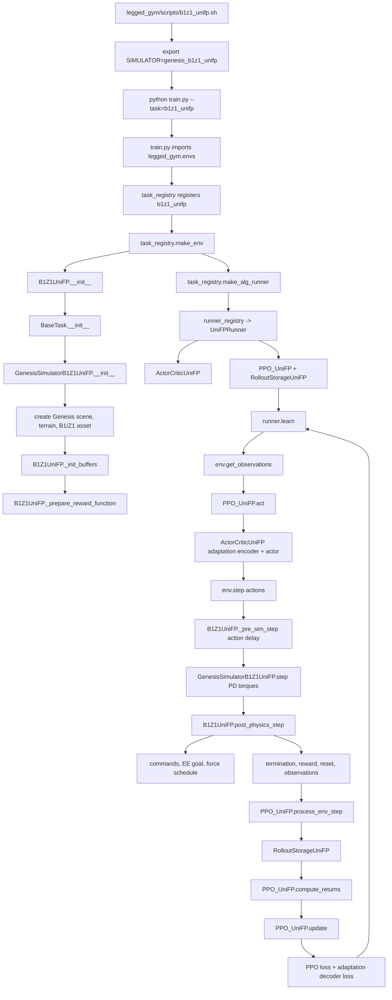

# B1/Z1 UniFP Genesis Baseline Port

This document describes the initial programmatic port of the original UniFP B1 quadruped + Z1 arm position-force formulation into the HCR Genesis training framework.

The new task is registered as:

```bash
--task=b1z1_unifp
```

The launcher is:

```bash
legged_gym/scripts/b1z1_unifp.sh
```

It uses the simulator selector:

```bash
SIMULATOR=genesis_b1z1_unifp
```

## Added Files

Core task:

```text
legged_gym/envs/b1z1/b1z1_unifp/b1z1_unifp.py
legged_gym/envs/b1z1/b1z1_unifp/b1z1_unifp_config.py
legged_gym/envs/b1z1/b1z1_unifp/__init__.py
```

Simulator:

```text
legged_gym/simulator/genesis_simulator_b1z1_unifp.py
```

Training stack:

```text
rsl_rl/modules/actor_critic_unifp.py
rsl_rl/algorithms/ppo_unifp.py
rsl_rl/storage/rollout_storage_unifp.py
rsl_rl/runners/unifp_runner.py
```

Asset:

```text
resources/robots/b1z1_current/
```

## Standalone Config

`B1Z1UniFPCfg` and `B1Z1UniFPCfgPPO` are intentionally standalone. They do not subclass `LeggedRobotCfg` or `LeggedRobotCfgPPO`.

That means all fields required by the HCR task registry, Genesis simulator, terrain generator, runner, PPO, and logging path are explicitly present in:

```text
legged_gym/envs/b1z1/b1z1_unifp/b1z1_unifp_config.py
```

## Environment Parameters

`cfg.env` controls tensor dimensions and rollout bookkeeping.

Important values:

```text
num_observations = 73
num_obs_hist = 32
num_privileged_obs = 149
num_priv_stack = 3
num_explicit_recon_obs = 12
num_pred_obs = 12
num_actions = 17
num_gripper_joints = 2
```

Where they interact:

```text
B1Z1UniFP.compute_observations()
OnPolicyRunnerUniFP.__init__()
PPO_UniFP.init_storage()
RolloutStorageUniFP
ActorCriticUniFP
```

The actor receives a stacked observation:

```text
73 * 32 = 2336
```

The critic receives stacked privileged observations:

```text
149 * 3 = 447
```

The single privileged frame is assembled to match UniFP's 149D layout:

```text
explicit prediction labels      12
leg reference DOF difference    12
mass/COM parameter block        22
friction coefficient             1
motor strength residuals        17
stance mask                      4
contact mask                     4
projected gravity                3
base angular velocity            3
learned DOF position error      17
learned DOF velocity            17
previous action                 17
gait phase sin/cos               2
15D command vector              15
force-offset EE spherical goal   3
total                          149
```

The explicit adaptation labels are 12D:

```text
base linear velocity        3
EE spherical position       3
EE local force              3
base local force            3
```

## Action Parameters

The policy outputs 17 actions:

```text
12 leg position targets
5 arm position targets
```

The physical model has 19 DOFs because the gripper joints remain in the URDF. The Genesis simulator maps the 17 learned actions onto the first 17 DOFs and keeps the gripper DOFs at fixed PD defaults.

Relevant code:

```text
B1Z1UniFPCfg.env.num_actions
B1Z1UniFPCfg.asset.dof_names
GenesisSimulatorB1Z1UniFP._compute_torques()
```

## Command Parameters

The UniFP command vector is 15D:

```text
0:3    base velocity command: x, y, yaw
3:6    EE spherical position command: radius, pitch, yaw
6:9    EE orientation delta command
9:12   commanded EE force
12:15  commanded base force
```

Relevant code:

```text
B1Z1UniFPCfg.commands
B1Z1UniFP._resample_commands()
B1Z1UniFP._resample_ee_goal()
B1Z1UniFP.update_curr_ee_goal()
B1Z1UniFP.compute_observations()
```

The EE position command is represented in a yaw-aligned spherical frame around a moving base-relative center:

```text
center = base_pos + yaw_rotation * [0.3, 0.0, 0.70]
```

The spherical command is converted with:

```text
x = r * cos(pitch) * cos(yaw)
y = r * cos(pitch) * sin(yaw)
z = r * sin(pitch)
```

## Force Randomization Parameters

Force randomization begins after:

```text
force_start_step * runner_steps_per_iter
```

Current values:

```text
force_start_step = 8000
runner_steps_per_iter = 24
activation step = 192000
```

Relevant config:

```text
cfg.commands.max_push_force_xyz_gripper_cmd
cfg.commands.max_push_force_xyz_gripper_ext
cfg.commands.gripper_force_kp_range
cfg.commands.gripper_force_kd_range
cfg.commands.max_push_force_xyz_base_cmd
cfg.commands.max_push_force_xyz_base_ext
cfg.commands.base_force_kp_range
cfg.commands.base_force_kd_range
```

Relevant code:

```text
B1Z1UniFP.force_randomization_active
B1Z1UniFP._push_gripper()
B1Z1UniFP._push_robot_base()
B1Z1UniFP._update_force_stream()
B1Z1UniFP._reward_tracking_ee_force_world()
B1Z1UniFP._reward_tracking_lin_vel_force_world()
GenesisSimulatorB1Z1UniFP.apply_ee_force()
GenesisSimulatorB1Z1UniFP.apply_base_force()
```

The simulator hooks store the EE and base force disturbances in simulator buffers, then apply them to the corresponding Genesis links before every simulator substep.

## EE Force Randomization Mechanics

The UniFP formulation uses two related EE force quantities:

```text
current_Fxyz_gripper_cmd
ee_force_ext_world
```

`current_Fxyz_gripper_cmd` is the commanded EE force component. It is part of the 15D command vector and is observable by the policy through command dimensions `9:12`.

`ee_force_ext_world` is the external disturbance force component. It represents a force applied at the EE/gripper link in world coordinates. This is not directly a command; it is treated as an environment disturbance and appears in privileged/adaptation labels after transformation into the yaw-aligned local frame.

### Activation

The force randomization gate is:

```python
common_step_counter > cfg.commands.force_start_step * cfg.runner_steps_per_iter
```

Current values:

```text
force_start_step = 8000
runner_steps_per_iter = 24
activation = 192000 environment steps
```

Before this threshold, EE and base force disturbances stay at zero except for reset clearing. After the threshold, the task runs the original UniFP-style force event scheduler.

### Sampling

The Genesis port now uses the same force-window structure as the original UniFP implementation. Instead of resampling force vectors directly on the command resampling period, it maintains independent event streams for:

```text
EE commanded force
EE external force
base commanded force
base external force
```

Each stream has randomized per-env intervals, randomized durations, a forced-probability gate, a ramp-up phase, a settling/hold phase, a ramp-down phase, and a reset-to-zero phase.

For the EE path, `B1Z1UniFP.step()` calls:

```text
B1Z1UniFP._push_gripper()
```

That method updates both:

```text
current_Fxyz_gripper_cmd
ee_force_ext_world
```

The relevant config fields are:

```text
cfg.commands.push_gripper_interval_s_cmd = [3.5, 9.0]
cfg.commands.push_gripper_duration_s_cmd = [1.0, 3.0]
cfg.commands.gripper_forced_prob_cmd = 0.8
cfg.commands.push_gripper_interval_s_ext = [3.5, 9.0]
cfg.commands.push_gripper_duration_s_ext = [1.0, 3.0]
cfg.commands.gripper_forced_prob_ext = 0.8
cfg.commands.settling_time_force_gripper_s = 1.0
cfg.commands.max_push_force_xyz_gripper_ext = [-60.0, 60.0]
cfg.commands.max_push_force_xyz_gripper_cmd = [-60.0, 60.0]
```

At the beginning of a force event, target forces are sampled uniformly:

```python
force_target_gripper_ext[env_ids] =
    uniform(force_min, force_max, shape=(num_selected_envs, 3))

force_target_gripper_cmd[env_ids] =
    uniform(cmd_min, cmd_max, shape=(num_selected_envs, 3))
```

Then the active force ramps from zero to the target over the sampled duration:

```python
current_force =
    force_target / duration
    * clamp(episode_step - (push_end_time - duration), 0, duration)
```

After `settling_time_force_gripper`, the force ramps back to zero:

```python
current_force =
    force_target
    - force_target / duration
      * clamp(episode_step - (push_end_time + settling_time), 0, duration)
```

When the event completes, the selected flag, target force, current force, duration, and end time are cleared, and a new random interval is sampled for that environment.

## Base Force Randomization Mechanics

The Genesis UniFP port now disables the generic domain-randomization base push pipeline:

```text
cfg.domain_rand.push_robots = False
```

That means `B1Z1UniFP._post_physics_step_callback()` no longer calls the simulator's generic `push_robots()` perturbation path. Base disturbances instead follow the same UniFP command/disturbance abstraction used by the EE.

The base force path uses two quantities:

```text
current_Fxyz_base_cmd
base_force_ext_world
```

`current_Fxyz_base_cmd` is the commanded base force component. It is written into command dimensions `12:15`, so the policy can observe it through the command slice.

`base_force_ext_world` is the external base force disturbance. It is not directly written into the command vector. It is rotated into the yaw-aligned local frame for explicit/adaptation labels, and it shifts the effective base velocity command inside `tracking_lin_vel_force_world`.

The path is enabled by:

```text
cfg.commands.push_robot_base = True
```

After the same force-randomization activation threshold used by the EE path, `B1Z1UniFP.step()` calls:

```text
B1Z1UniFP._push_robot_base()
```

The base path uses the same event scheduler, but with separate interval/duration/probability fields:

```text
cfg.commands.push_base_interval_s_cmd = [3.5, 9.0]
cfg.commands.push_base_duration_s_cmd = [1.0, 3.0]
cfg.commands.base_forced_prob_cmd = 0.8
cfg.commands.push_base_interval_s_ext = [6.0, 12.0]
cfg.commands.push_base_duration_s_ext = [1.0, 3.0]
cfg.commands.base_forced_prob_ext = 0.8
cfg.commands.settling_time_force_base_s = 3.0
cfg.commands.max_push_force_xyz_base_ext = [-50.0, 50.0]
cfg.commands.max_push_force_xyz_base_cmd = [-50.0, 50.0]
cfg.commands.force_z_base_ext_scale = 0.1
```

Like the original UniFP code, commanded base force samples have zero vertical component. External base force samples include a vertical component, but it is scaled by `force_z_base_ext_scale`.

The command vector is updated in `update_curr_ee_goal()`:

```python
commands[:, 12:15] = current_Fxyz_base_cmd
```

The force-aware base tracking reward uses the yaw-local external base force plus the commanded base force as an impedance-like velocity-command offset:

```python
base_force_local = yaw_inverse_rotation(base_force_ext_world)

effective_base_velocity_command =
    commands[:, :2]
    + (base_force_local + current_Fxyz_base_cmd)[:, :2] / base_force_kds
```

and then compares that target against the actual base linear velocity:

```python
tracking_lin_vel_force_world =
    exp(-||effective_base_velocity_command - base_lin_vel[:, :2]||^2 / tracking_sigma)
```

On reset, both base force buffers are cleared and the simulator-side base force buffer is updated through:

```text
GenesisSimulatorB1Z1UniFP.apply_base_force(base_force_ext_world)
```

As with the EE hook, this updates the simulator buffer used by the per-substep Genesis force application path.

### Command Vector Interaction

After each EE goal update, the task writes the current EE force command into the command vector:

```python
commands[:, 9:12] = current_Fxyz_gripper_cmd
```

That means the policy can observe the commanded force component through the actor observation history. The external disturbance force is not written into the command vector; it is represented through privileged/adaptation labels and reward target offsets.

### Observation And Adaptation Labels

During observation construction, the external EE force is rotated into the yaw-aligned local frame:

```python
ee_force_local = quat_rotate_inverse(base_yaw_quat, ee_force_ext_world)
```

The 12D explicit prediction/adaptation target contains:

```text
base linear velocity      3
EE spherical position     3
EE local force            3
base local force          3
```

So the EE disturbance affects the adaptation target through the EE local force slice.

### Reward Coupling

The EE force randomization enters the key manipulation reward through the effective EE target:

```python
force_offset =
    (ee_force_ext_world + yaw_rotation(current_Fxyz_gripper_cmd))
    / gripper_force_kps

effective_EE_target =
    curr_ee_goal_cart_world + force_offset
```

The reward then tracks the physical EE position against that offset target:

```python
tracking_ee_force_world =
    exp(-||effective_EE_target - ee_pos||^2 / tracking_ee_sigma)
```

This is the main UniFP force-position trick: force control is converted into a target-position shift using a stiffness-like gain instead of directly asking the policy to output force/torque.

### Physical Application In The Genesis Port

The port currently includes:

```text
GenesisSimulatorB1Z1UniFP.apply_ee_force(force_world)
GenesisSimulatorB1Z1UniFP.apply_base_force(force_world)
```

These hooks store the target forces in simulator buffers:

```python
self._ee_force_world[:] = force_world
self._base_force_world[:] = force_world
```

During `GenesisSimulatorB1Z1UniFP.step()`, the simulator rebuilds a compact external-force tensor:

```python
external_force_world[:, 0, :] = ee_force_world
external_force_world[:, 1, :] = base_force_world
```

and applies it before each `scene.step()` using Genesis 0.3.11's rigid solver API:

```python
robot._solver.apply_links_external_force(
    force=external_force_world,
    links_idx=[gripper_link_global_idx, base_link_global_idx],
    ref="link_com",
    local=False,
)
```

This mirrors the original Isaac Gym approach of applying world-frame rigid-body force tensors every simulation substep. The Genesis call uses `ref="link_com"` so the force is applied as a linear force at the link center of mass, matching the no-explicit-torque behavior of Isaac Gym's `apply_rigid_body_force_tensors(..., torques=None, GLOBAL_SPACE)`.

### Strict-Fidelity Follow-Up

For a stricter reproduction of the original UniFP EE-force randomization, the Genesis port should:

```text
1. Add separate timers for commanded EE force and external EE force.
2. Restore interval and duration sampling from the original UniFP config.
3. Restore forced-probability sampling for whether a force window is active.
4. Restore settling-time behavior.
5. Apply external force physically at ee_gripper_link through Genesis.
6. Keep commanded force as an observed command, not as a physical force by itself.
7. Validate world-frame versus yaw-local-frame conversions with a fixed-base smoke test.
```

## Asset Parameters

The B1/Z1 URDF is loaded from:

```text
resources/robots/b1z1_current/urdf/b1z1.urdf
```

The task keeps the following fixed-joint links unmerged:

```text
FR_foot
FL_foot
RR_foot
RL_foot
ee_gripper_link
```

Relevant code:

```text
B1Z1UniFPCfg.asset
GenesisSimulatorB1Z1UniFP._create_envs()
```

The DOF order is explicitly listed in the config and is used by the simulator for observations, PD control, torque limits, and domain randomization.

## Terrain And Curriculum Parameters

The baseline starts with HCR-style Genesis heightfield terrain:

```text
mesh_type = "heightfield"
curriculum = True
measure_heights = True
obtain_terrain_info_around_feet = True
```

Relevant code:

```text
B1Z1UniFPCfg.terrain
GenesisSimulatorB1Z1UniFP._create_sim()
GenesisSimulatorB1Z1UniFP._get_env_origins()
B1Z1UniFP._update_terrain_curriculum()
```

The command curriculum expands the base velocity command ranges using the UniFP tracking reward:

```text
tracking_lin_vel_force_world
```

Relevant code:

```text
B1Z1UniFP._update_command_curriculum()
```

Reward curriculum uses HCR's cosine interpolation style:

```text
B1Z1UniFPCfg.rewards.reward_curriculum
B1Z1UniFP.step_reward_curriculum()
```

## Domain Randomization Parameters

The standalone config includes HCR's performance-gated domain randomization fields:

```text
friction
base mass
COM displacement
control delay
PD gain scale
motor strength
joint armature
joint friction
joint damping
push/wrench curriculum parameters
```

Relevant code:

```text
B1Z1UniFPCfg.domain_rand
GenesisSimulatorB1Z1UniFP._parse_cfg()
GenesisSimulatorB1Z1UniFP._init_domain_params()
GenesisSimulatorB1Z1UniFP.reset_idx()
GenesisSimulatorB1Z1UniFP._step_domian_rand()
```

The new UniFP runner calls the domain-randomization curriculum only when a tracking metric is available.

## Reward Parameters

The active reward names are defined in:

```text
B1Z1UniFPCfg.rewards.scales
```

The environment maps each nonzero reward scale to:

```text
_reward_<name>
```

Relevant code:

```text
B1Z1UniFP._prepare_reward_function()
B1Z1UniFP.compute_reward()
```

Key UniFP-specific rewards:

```text
tracking_lin_vel_force_world
tracking_ee_force_world
```

These implement the original force-position coupling by offsetting the effective position target using force divided by a stiffness-like gain.

For EE tracking:

```text
effective_target = EE_position_target + (external_EE_force + commanded_EE_force_world) / gripper_force_kp
```

For base velocity tracking:

```text
effective_base_velocity_command = base_velocity_command + base_force / base_force_kp
```

## UniFP Reward Differences From PACT

The UniFP B1/Z1 task contains several rewards that either involve the Z1 arm directly, couple the arm/EE with the quadruped base, or do not cleanly overlap with the Go1/Go2 PACT locomotion reward set.

### Arm-Specific Rewards

These rewards act primarily on the arm joints or end-effector behavior.

```text
dof_vel_arm
dof_acc_arm
action_rate_arm
tracking_ee_force_world
```

`dof_vel_arm` penalizes Z1 arm joint velocity. It discourages fast arm motion that can destabilize the quadruped or create unrealistic arm behavior.

`dof_acc_arm` penalizes arm joint acceleration. This is the arm analogue of the leg acceleration regularizer, but it matters more for manipulation because arm acceleration can inject large body disturbances through the mounting point.

`action_rate_arm` penalizes changes in the arm action dimensions. It keeps the learned arm position targets smooth and reduces high-frequency PD target modulation.

`tracking_ee_force_world` is the most important arm-side UniFP reward. It tracks the EE target after applying the force-position offset:

```text
effective_EE_target = EE_position_target + EE_force_term / gripper_force_kp
```

This is not a standard PACT locomotion reward. It is a manipulation reward that uses the arm's EE position as the interface through which force control is indirectly expressed.

### Coupled Arm + Quadruped Rewards

These rewards couple the manipulator and mobile base rather than treating the arm as a separate appendage.

```text
tracking_lin_vel_force_world
tracking_ee_force_world
base_height
roll
feet_contact_number
feet_contact_forces
torques
torque_limits
```

`tracking_lin_vel_force_world` is a base locomotion reward, but in UniFP it is force-aware. The commanded or external base force can offset the effective velocity command. This makes base tracking part of the same position-force abstraction used for the EE.

`tracking_ee_force_world` couples arm behavior back into whole-body balance because the EE target is expressed relative to a yaw-aligned moving base frame. The robot must position the base, legs, and arm together to satisfy the reward.

`base_height` and `roll` are not arm rewards by themselves, but they become coupled terms in B1/Z1 because arm motion and EE disturbances can pitch, roll, or unload the base.

`feet_contact_number`, `feet_contact_forces`, and the torque-limit terms become arm+quadruped coupled rewards when EE forces are active. They regularize how the legs absorb arm-induced and contact-induced disturbances.

### UniFP-Specific Or Non-PACT-Overlapping Rewards

These rewards do not directly match the main HCR PACT reward vocabulary, or they have different semantics in UniFP.

```text
tracking_ee_force_world
tracking_lin_vel_force_world
feet_contact_number
ref_dof_leg
stand_still
feet_pos_xy
feet_height_high
feet_drag
roll
alive
```

`tracking_ee_force_world` is unique to the manipulation formulation.

`tracking_lin_vel_force_world` differs from PACT's `tracking_lin_vel` because the target can be shifted by the force-command pathway.

`feet_contact_number` rewards a desired contact count/gait structure. PACT uses richer locomotion stability and terrain-aware rewards, but this exact contact-count reward is a UniFP gait-shaping term.

`ref_dof_leg` encourages the legs to remain close to a reference gait posture. PACT has posture/default-position terms, but UniFP's version is tied to its phase/reference-leg machinery.

`stand_still` applies a posture penalty/reward behavior when base commands are near zero. PACT has stand-still-style terms in some configs, but the UniFP version is tied to the 15D command structure and the manipulation setting.

`feet_pos_xy` penalizes horizontal foot placement relative to the body. HCR PACT uses support polygon, overreach, VHIP, and terrain-aware foot clearance terms instead, so this reward is not a one-to-one overlap.

`feet_height_high` penalizes excessive foot height. PACT usually emphasizes desired clearance or terrain-aware clearance rather than this high-foot penalty.

`feet_drag` penalizes feet moving while in contact. PACT has foot slip/stumble style rewards, but UniFP's drag term is a simpler contact-velocity penalty.

`roll` separately penalizes base roll. PACT commonly uses orientation or projected-gravity penalties, so this is overlapping in intent but not in exact formulation.

`alive` is a survival bonus. PACT may include small alive bonuses in some configs, but it is not central to the PACT PINN/coupled-torque formulation.

## Policy Architecture

The port uses the original UniFP CSE/adaptation-style actor-critic instead of the HCR PACT dual-head policy.

Relevant code:

```text
rsl_rl/modules/actor_critic_unifp.py
```

Architecture:

```text
adaptation encoder:
  input  = 2336 stacked actor observation
  output = latent_dim = history_len * 2 = 64

actor:
  input  = current 73D observation + 64D latent
  output = 17D Gaussian mean

critic:
  input  = 447D stacked privileged observation
  output = scalar value

adaptation decoder:
  input  = 64D latent
  output = 12D explicit labels
```

## Training Flow



## Current Runtime Follow-Up Items

This first pass has been lightly runtime-validated on plane terrain with one CPU Genesis environment.

Completed validation checks:

```text
Python syntax compile for new task/simulator/runner/PPO/storage/policy files: passed
Standalone config import and dimension check: passed
Task registry resolves b1z1_unifp: passed
Runner registry resolves UniFPRunner: passed
ActorCriticUniFP shape test: passed
  actor obs/history input: 2336
  critic input: 447
  action output: 17
  adaptation label output: 12
One-env Genesis construction on plane terrain: passed
One reset + one env.step on plane terrain: passed
  obs: 73
  privileged obs stack: 447
  actor history: 2336
  explicit labels: 12
  rewards finite: yes
Runner/storage construction: passed
  rollout observations: [24, 1, 2336]
  privileged observations: [24, 1, 447]
  explicit labels: [24, 1, 12]
  actions: [24, 1, 17]
Tiny one-iteration PPO smoke test on plane terrain: passed
  num_envs: 1
  num_steps_per_env: 2
  learning_epochs: 1
  mini_batches: 1
```

Fixes made during validation:

```text
Added genesis_b1z1_unifp to legged_gym/__init__.py simulator allow-list.
Normalized Genesis DOF limit tensor shape from [env, 2, dof] to [env, dof, 2].
Made PPO_UniFP tolerate extra HCR-style algorithm config keys such as use_spo.
Updated DOF/torque limit rewards to handle batched Genesis limit tensors.
```

Known follow-up checks:

```text
Confirm Genesis external rigid-body force API for apply_ee_force().
Confirm B1/Z1 URDF loads with merge_fixed_links=True and links_to_keep including ee_gripper_link.
Confirm Genesis link names for feet and ee_gripper_link match the config.
Confirm the 19-DOF order exactly matches the config list.
Tune heightfield terrain against the original UniFP trimesh rough-flat terrain.
Compare reward magnitudes against the Isaac Gym UniFP baseline.
```
